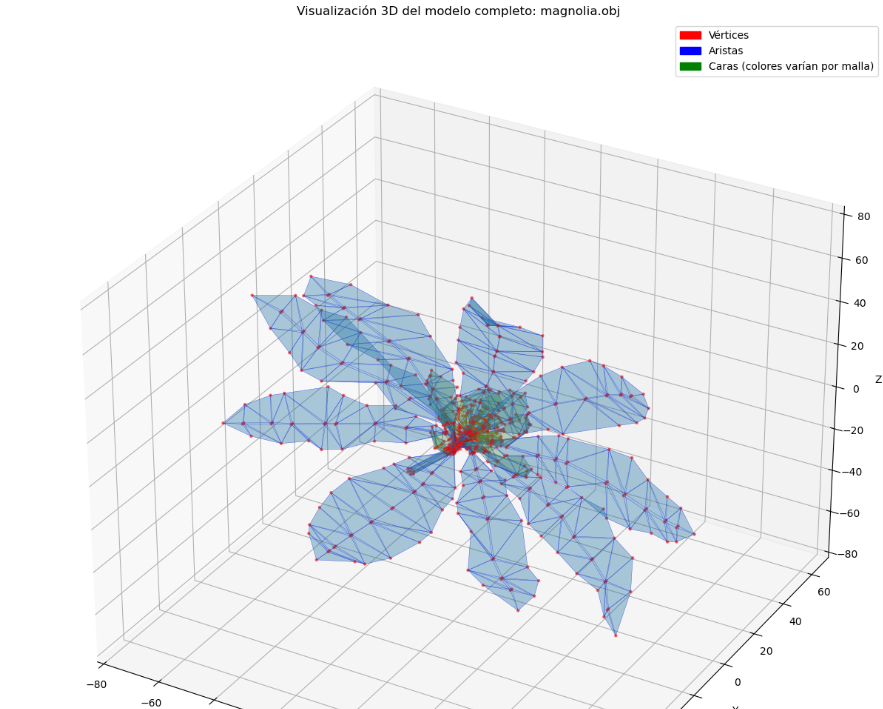

# 🧪 Construyendo Mundo 3D

## [](#-fecha)📅 Fecha

`2025-05-01` 

----------

## [](#-objetivo-del-taller)🎯 Objetivo del Taller

El objetivo principal de este taller es comprender en profundidad las estructuras fundamentales que componen los modelos tridimensionales, específicamente las mallas poligonales. A través de la exploración práctica en diferentes entornos de desarrollo, se busca visualizar y analizar la disposición de vértices, aristas y caras, así como entender el contenido de formatos de archivo comunes como .OBJ.

----------

## [](#-conceptos-aprendidos)🧠 Conceptos Aprendidos


* Transformaciones geométricas (escala, rotación, traslación) 
* Visualización de mallas poligonales
* Estructura de datos de modelos 3D (vértices, aristas, caras) 
* Carga y manipulación de archivos .OBJ
* Uso de loaders en Three.js 
* Aplicación de materiales básicos en Three.js 
* Visualización de la estructura de mallas mediante líneas y puntos 
* Inspección de la información estructural de modelos 3D 
* Uso de bibliotecas Python para el procesamiento de mallas (trimesh)
----------

## [](#-herramientas-y-entornos)🔧 Herramientas y Entornos
-   Python
-   Three.js
-   Jupyter


----------

## [](#-estructura-del-proyecto)📁 Estructura del Proyecto

2025-05-01_taller_estructuras_3d/
├── python/
├── threejs/
├── README.md

----------

## [](#-implementaci%C3%B3n)🧪 Implementación (Python)


### 🔹 Etapas realizadas

1.  **Preparación de datos o escena**
    -   Importación de bibliotecas necesarias (trimesh, numpy, matplotlib)
    -   Carga del modelo 3D desde un archivo OBJ
    -   Procesamiento inicial para manejar escenas con múltiples mallas
2.  **Aplicación de modelo o algoritmo**
    -   Extracción de información estructural (vértices, caras, aristas)
    -   Cálculo de propiedades geométricas (volumen, área, normales)
    -   Análisis de características topológicas (manifold/watertight)
3.  **Visualización o interacción**
    -   Renderizado 3D de todas las mallas del modelo
    -   Representación visual diferenciada de vértices, aristas y caras
    -   Visualización de normales para análisis de orientación de superficies
4.  **Guardado de resultados**
    -   Presentación de estadísticas completas del modelo
    -   Exportación de visualizaciones
    -   Documentación de hallazgos

### 🔹 Código relevante

Este fragmento resume la esencia del taller, mostrando cómo procesar y visualizar todas las mallas de un modelo 3D:


```python
# Cargar el modelo 3D
modelo = trimesh.load(os.path.join('..', 'magnolia.obj'))

# Extraer y procesar todas las mallas
if isinstance(modelo, trimesh.Scene):
    mallas = list(modelo.geometry.values())
    print(f"La escena contiene {len(mallas)} mallas.")
else:
    mallas = [modelo]

# Visualizar cada malla con colores distintos
fig = plt.figure(figsize=(14, 12))
ax = fig.add_subplot(111, projection='3d')

for idx, malla in enumerate(mallas):
    vertices = malla.vertices
    
    # Visualizar vértices (puntos rojos)
    ax.scatter(vertices[:, 0], vertices[:, 1], vertices[:, 2], 
               color='red', s=5, alpha=0.5)
    
    # Visualizar aristas (líneas azules)
    for inicio, fin in malla.edges_unique:
        x = [vertices[inicio, 0], vertices[fin, 0]]
        y = [vertices[inicio, 1], vertices[fin, 1]]
        z = [vertices[inicio, 2], vertices[fin, 2]]
        ax.plot(x, y, z, color='blue', linewidth=0.3, alpha=0.7)
    
    # Visualizar caras (triángulos con colores aleatorios)
    color_caras = (random.random(), random.random(), random.random())
    ax.plot_trisurf(vertices[:, 0], vertices[:, 1], vertices[:, 2], 
                   triangles=malla.faces, alpha=0.2, color=color_caras)

plt.show()
```

----------

## [](#-resultados-visuales)📊 Resultados Visuales

Proyecto de Python:


----------

## [](#-prompts-usados)🧩 Prompts Usados


Modelo Generativo DeepSeek-V3 :
```
Genera código React funcional usando @react-three/drei para cargar un modelo 3D en formato .OBJ. El código debe importar y configurar los loaders necesarios, cargar el archivo magnolia.obj desde la carpeta public/ e integrarlo en una escena básica con iluminación. Incluye comentarios explicativos para cada paso.
```
```
Genera un bloque de código React que asigne automáticamente un MeshStandardMaterial a todos los elementos Mesh de un objeto 3D de Three.js, usando un useEffect
```

Modelo Generativo: Claude 3.7 Sonnet

```
Genera código Python funcional para un jupyter notebook en donde cargues un modelo 3d llamado magnolia.obj que se encuentra una carpeta arriba del archivo python usando trimesh. Debe visualizarse la malla 3d con colores distintos para vértices, aristas y caras. Debe mostrar la información estructural del modelo, su número de vértices, aristas y caras. Genera código limpio, con comentarios explicativos. También explica paso a paso su lógica.
```
Modelo Generativo: Gemini 2.0
```
Actúa como un asistente experto en la creación de documentación técnica, específicamente para un README de un taller sobre estructuras 3D. Basándote en la siguiente información, genera el contenido para estas secciones del README.md en formato Markdown. Mantén un tono conciso y profesional, enfocándote en la claridad y la información esencial.
* **🎯 Objetivo del Taller**
* **🧠 Conceptos Aprendidos** (en formato de lista Markdown) transformaciones geométricas escala rotación traslación, visualización de la estructura de mallas mediante líneas y puntos, carga y manipulación de archivos obj, uso de loaders en three js, estructura de datos de modelos 3d vértices aristas caras, aplicación de materiales básicos en three js, visualización de mallas poligonales, uso de bibliotecas python para el procesamiento de mallas trimesh, inspección de la información estructural de modelos 3d
* **🧪 Implementación** (explicando brevemente cada implementación y resaltando el código relevante como bloques de código Markdown) 
* **💬 Reflexión Final** (en 2-3 parrafos por punto en Markdown) aprendizaje sobre representacion modelos 3d con mallas, exploracion de vertices aristas y caras en distintos entornos, obtencion de perspectiva sobre construccion y manipulacion de objetos 3d, implementacion en threejs para visualizacion interactiva del modelo, uso de python con trimesh para analisis y representacion de la informacion geometrica, fue interesante ver la interpretacion y visualizacion de la misma informacion estructural en diferentes entornos, la facilidad de threejs y la profundidad de python fueron notables, para futuro me gustaria combinar tecnicas para crear herramientas interactivas de analisis y visualizacion
Asegúrate de que la salida esté completamente en formato Markdown.
```
----------

## [](#-reflexi%C3%B3n-final)💬 Reflexión Final


A través de este taller, he logrado consolidar mi comprensión sobre la representación de modelos 3D mediante mallas poligonales. Explorar la estructura de vértices, aristas y caras en diferentes entornos me ha proporcionado una perspectiva más clara de cómo se construyen y manipulan los objetos tridimensionales en el ámbito digital. La implementación en Three.js con React Three Fiber me permitió visualizar interactivamente el modelo y su estructura, mientras que el uso de Python con la biblioteca trimesh me ofreció la posibilidad de analizar y representar la información geométrica de manera programática.

La parte más interesante fue observar cómo la misma información estructural del modelo (.OBJ) se interpreta y visualiza de manera distinta en cada entorno. En Three.js, la facilidad de integrar componentes como `<Edges>` para resaltar las aristas hizo que la visualización de la estructura fuera intuitiva. En Python, la manipulación directa de los datos de vértices y aristas con trimesh y la posterior visualización, aunque requirió un poco más de código, brindó un entendimiento más profundo de la organización de la malla. Para futuros proyectos, me gustaría explorar cómo combinar estas técnicas para crear herramientas interactivas de análisis y visualización de modelos 3D, quizás integrando la potencia de procesamiento de Python con la capacidad de renderizado en tiempo real de Three.js.
