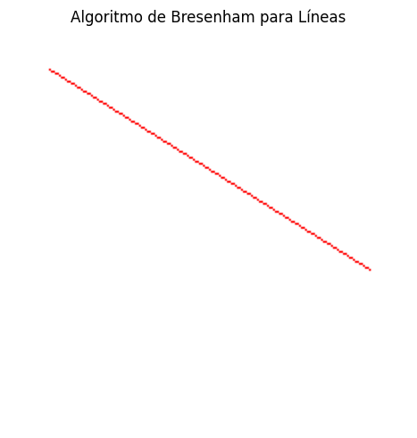
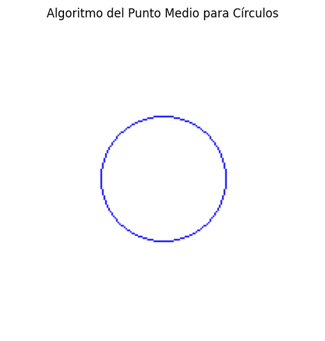
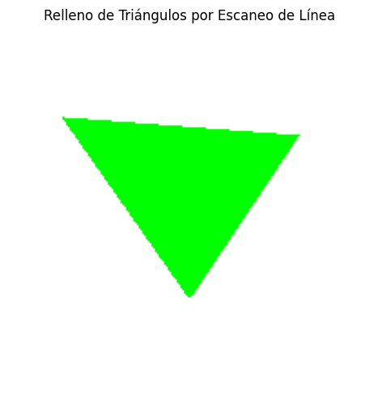

# 🧪 Rasterización desde Cero: Dibujando con Algoritmos Clásicos

## [](#-fecha)📅 Fecha

`2025-05-01`

----------

## [](#-objetivo-del-taller)🎯 Objetivo del Taller

Este taller tiene como objetivo explorar y comprender el procesamiento de imágenes digitales como matrices de píxeles utilizando OpenCV, NumPy y Matplotlib en Google Colab. Se busca demostrar cómo manipular las imágenes a nivel de píxel, visualizar sus componentes de color, realizar transformaciones básicas y aplicar ajustes interactivos en tiempo real.

----------

## [](#-conceptos-aprendidos)🧠 Conceptos Aprendidos


-   Algoritmos de rasterización para primitivas básicas
-   Transformaciones geométricas (implícitas en el algoritmo de círculos)
-   Manipulación de píxeles a nivel bajo
-   Técnicas de antialiasing y optimización visual
-   Fundamentos de gráficos por computadora
-   Interpolación de coordenadas
----------

## [](#-herramientas-y-entornos)🔧 Herramientas y Entornos

-   Google Colab
- Python


----------

## [](#-estructura-del-proyecto)📁 Estructura del Proyecto

├── python/
│   └── rasterizacion_algoritmos.ipynb
├── resultados/
│   ├── linea.png
│   ├── circulo.png
│   ├── triangulo.png
├── README.md


## 🧪 Implementación

### 🔹 Etapas realizadas

1.  Preparación del entorno de dibujo con PIL
2.  Implementación del algoritmo de Bresenham para líneas
3.  Implementación del algoritmo del punto medio para círculos
4.  Implementación de relleno de triángulos por escaneo
5.  Visualización y almacenamiento de resultados

### 🔹 Código relevante

python

```python
# Algoritmo de Bresenham para dibujar líneas
def bresenham(image, x0, y0, x1, y1):
    pixels = image.load()
    dx = abs(x1 - x0)
    dy = abs(y1 - y0)
    sx = 1 if x0 < x1 else -1
    sy = 1 if y0 < y1 else -1
    err = dx - dy
    
    while True:
        pixels[x0, y0] = (255, 0, 0)  # Color rojo
        if x0 == x1 and y0 == y1:
            break
        e2 = 2 * err
        if e2 > -dy:
            err -= dy
            x0 += sx
        if e2 < dx:
            err += dx
            y0 += sy
```
## [](#-resultados-visuales)📊 Resultados Visuales

### Línea (Algoritmo de Bresenham)  ### Círculo (Algoritmo de Punto Medio)  ### Triángulo (Relleno por Scanline) 
----------

## [](#-prompts-usados)🧩 Prompts Usados


Modelo Generativo Claude 3.7 Sonnet :
```
Genera un script en Python (compatible con Google Colab) que utilice Pillow (para crear imágenes)

numpy (opcional para operaciones matriciales)

matplotlib.pyplot (para mostrar resultados)

Debe preparar el entorno de dibujo de esta manera
from PIL import Image, ImageDraw
import matplotlib.pyplot as plt

width, height = 200, 200
image = Image.new('RGB', (width, height), 'white')
pixels = image.load()


Dibujar una línea con el algoritmo de Bresenham
def bresenham(x0, y0, x1, y1):
    dx = abs(x1 - x0)
    dy = abs(y1 - y0)
    sx = 1 if x0 < x1 else -1
    sy = 1 if y0 < y1 else -1
    err = dx - dy

    while True:
        pixels[x0, y0] = (255, 0, 0)
        if x0 == x1 and y0 == y1:
            break
        e2 = 2 * err
        if e2 > -dy:
            err -= dy
            x0 += sx
        if e2 < dx:
            err += dx
            y0 += sy
probar con:

bresenham(20, 20, 180, 120)

Dibujar un círculo con el algoritmo de punto medio
def midpoint_circle(x0, y0, radius):
    x = radius
    y = 0
    p = 1 - radius

    while x >= y:
        for dx, dy in [(x, y), (y, x), (-x, y), (-y, x), (-x, -y), (-y, -x), (x, -y), (y, -x)]:
            if 0 <= x0 + dx < width and 0 <= y0 + dy < height:
                pixels[x0 + dx, y0 + dy] = (0, 0, 255)
        y += 1
        if p <= 0:
            p = p + 2*y + 1
        else:
            x -= 1
            p = p + 2*y - 2*x + 1
 Probar con:

midpoint_circle(100, 100, 40)

Rellenar un triángulo (simple rasterización por scanline)

def fill_triangle(p1, p2, p3):
    # ordenar por y
    pts = sorted([p1, p2, p3], key=lambda p: p[1])
    (x1, y1), (x2, y2), (x3, y3) = pts

    def interpolate(y0, y1, x0, x1):
        if y1 - y0 == 0: return []
        return [int(x0 + (x1 - x0) * (y - y0) / (y1 - y0)) for y in range(y0, y1)]

    x12 = interpolate(y1, y2, x1, x2)
    x23 = interpolate(y2, y3, x2, x3)
    x13 = interpolate(y1, y3, x1, x3)

    x_left = x12 + x23
    for y, xl, xr in zip(range(y1, y3), x13, x_left):
        for x in range(min(xl, xr), max(xl, xr)):
            if 0 <= x < width and 0 <= y < height:
                pixels[x, y] = (0, 255, 0)
probar con
fill_triangle((30, 50), (100, 150), (160, 60))

Mostrar el resultado

plt.imshow(image)
plt.axis('off')
plt.show()

muestra los resultados en pngs de la siguiente manera
linea.png
circulo.png
triangulo.png
```

Modelo Generativo: GPT-4o
```

Redacta un documento en formato Markdown que describa un taller práctico sobre algoritmos básicos de rasterización. El documento debe incluir las siguientes secciones, con el contenido que se describe a continuación:

**Título:** "Taller de Computación Gráfica: Algoritmos Básicos de Rasterización"

**🎯 Objetivo del Taller:**
Escribe una breve descripción del objetivo principal del taller. Menciona que el taller se enfoca en la implementación y comprensión de los algoritmos fundamentales de rasterización: el algoritmo de Bresenham para dibujar líneas, el algoritmo del punto medio para círculos y el algoritmo de relleno de triángulos mediante escaneo de línea. Explica que el objetivo es entender cómo se transforman representaciones matemáticas en píxeles en la pantalla.

**🧠 Conceptos Aprendidos:**
Genera una lista de los conceptos clave que los participantes aprenderán en el taller. Incluye los siguientes temas: algoritmos de rasterización para primitivas básicas, transformaciones geométricas (menciona su relación con el algoritmo del círculo), manipulación de píxeles a nivel bajo, una breve mención de técnicas de antialiasing y optimización visual (sin entrar en detalles de implementación), fundamentos de gráficos por computadora e interpolación de coordenadas (especialmente relevante para el relleno de triángulos).

**🧪 Implementación:**
**🔹 Etapas realizadas:**
Enumera las etapas típicas que se llevarían a cabo en la implementación de estos algoritmos. Incluye la preparación del entorno de dibujo (mencionando el uso de bibliotecas como PIL), la implementación del algoritmo de Bresenham para líneas, la implementación del algoritmo del punto medio para círculos, la implementación del relleno de triángulos por escaneo y la visualización y almacenamiento de los resultados.

**🔹 Código relevante:**
Incluye un ejemplo del código de uno de los algoritmos implementados. Elige el algoritmo de Bresenham para dibujar líneas y presenta su función en Python, incluyendo comentarios que expliquen brevemente su lógica principal (cálculo de diferencias, manejo de errores, iteración para pintar píxeles).

**💬 Reflexión Final:**
Escribe un párrafo de reflexión sobre lo aprendido en el taller. Menciona la importancia de entender cómo funcionan estos algoritmos básicos y cómo convierten conceptos geométricos en píxeles. Describe brevemente la experiencia con alguno de los algoritmos (por ejemplo, la elegancia del algoritmo de Bresenham o la complejidad del relleno de triángulos) y cómo esto ayuda a comprender la función de las GPUs. También puedes incluir algunas ideas para futuros proyectos o la importancia de estos fundamentos en sistemas gráficos más avanzados.


```
----------


## 💬 Reflexión Final


En este taller he podido profundizar en la comprensión de cómo funcionan los algoritmos básicos que hacen posible la representación de gráficos en computadoras. Es fascinante ver cómo, a partir de fórmulas matemáticas y operaciones simples, podemos trasladar conceptos geométricos abstractos a una matriz de píxeles. Particularmente, me sorprendió la elegancia del algoritmo de Bresenham, que evita operaciones de punto flotante logrando una excelente aproximación de líneas rectas usando solo aritmética entera.

La parte más desafiante fue implementar el algoritmo de relleno de triángulos, ya que requiere una comprensión más profunda de cómo interpolar coordenadas y gestionar los casos especiales en los bordes. Este proceso me ayudó a entender mejor por qué los motores gráficos modernos utilizan GPUs especializadas para estas tareas, considerando la cantidad de cálculos necesarios incluso para formas geométricas simples.

En proyectos futuros, me gustaría expandir estos conceptos para implementar técnicas más avanzadas como antialiasing, sombreado y texturizado. También sería interesante implementar un pequeño motor de renderizado que pueda manejar primitivas en 3D y aplicar transformaciones más complejas. Estos algoritmos fundamentales son la base sobre la que se construyen sistemas gráficos complejos, desde videojuegos hasta software de modelado 3D profesional.