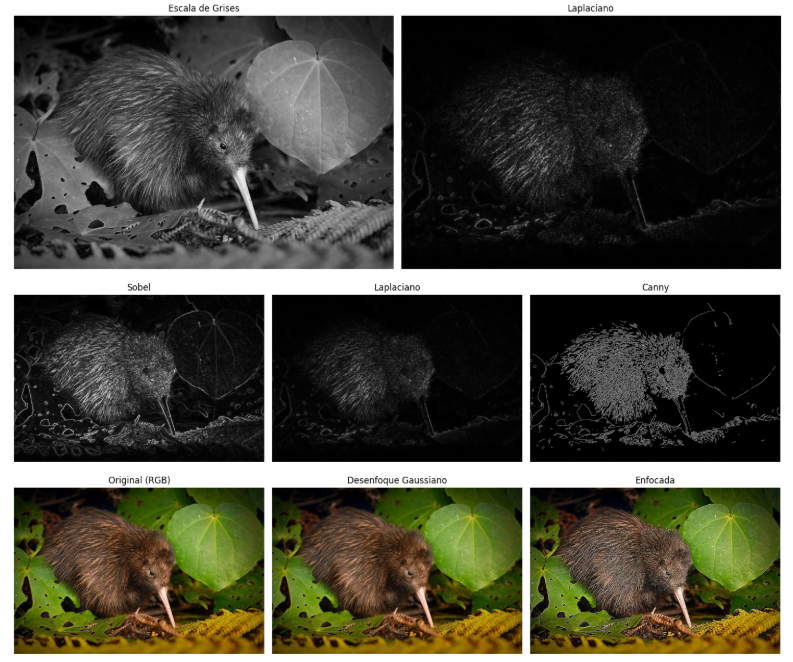

# 🧪 Introducción a la Visión Artificial con OpenCV

## [](#-fecha)📅 Fecha

`2025-05-01`

----------

## [](#-objetivo-del-taller)🎯 Objetivo del Taller

Este taller tiene como objetivo introducir los conceptos fundamentales de la visión artificial utilizando la biblioteca OpenCV en Python. Exploraremos cómo los computadores procesan imágenes digitales mediante transformaciones básicas, incluyendo filtros convolucionales y técnicas de detección de bordes. Al finalizar, entenderás las operaciones fundamentales que sirven como base para aplicaciones más avanzadas de visión artificial.

----------

## [](#-conceptos-aprendidos)🧠 Conceptos Aprendidos


-   Transformaciones geométricas (escala, rotación, traslación)
-   Segmentación de imágenes mediante detección de bordes
-   Filtros convolucionales y sus efectos en las imágenes
-   Extracción de características visuales básicas
-   Procesamiento de imágenes en color y escala de grises
----------

## [](#-herramientas-y-entornos)🔧 Herramientas y Entornos

-   Google Colab
- Python


----------

## [](#-estructura-del-proyecto)📁 Estructura del Proyecto

2025-05-01_taller_ojos_digitales
├── python/
├── README.md

## 🧪 Implementación

### 🔹 Etapas realizadas

1.  **Preparación de datos**: Carga de imágenes y conversión a escala de grises.
2.  **Aplicación de algoritmos**: Implementación de filtros de desenfoque, enfoque y detección de bordes.
3.  **Visualización**: Representación gráfica de cada transformación para comparar efectos.
4.  **Análisis avanzado**: Combinación de técnicas para extraer contornos y aplicar transformaciones geométricas.

### 🔹 Código relevante

python

```python
# Aplicación de detección de bordes con múltiples técnicas
# Operador Sobel para gradientes en X e Y
sobel_x = cv2.Sobel(imagen_gris, cv2.CV_64F, 1, 0, ksize=3)
sobel_y = cv2.Sobel(imagen_gris, cv2.CV_64F, 0, 1, ksize=3)
sobel_x_abs = cv2.convertScaleAbs(sobel_x)
sobel_y_abs = cv2.convertScaleAbs(sobel_y)
sobel_combinado = cv2.addWeighted(sobel_x_abs, 0.5, sobel_y_abs, 0.5, 0)

# Operador Laplaciano para detección de bordes
laplacian = cv2.Laplacian(imagen_gris, cv2.CV_64F)
laplacian_abs = cv2.convertScaleAbs(laplacian)

# Algoritmo Canny para detección avanzada de bordes
canny = cv2.Canny(imagen_gris, threshold1=100, threshold2=200)
```
----------

## [](#-resultados-visuales)📊 Resultados Visuales


Estas son solo algunas de las imágenes finales, script.ipynb las muestra todas directamente en GitHub.
----------

## [](#-prompts-usados)🧩 Prompts Usados


Modelo Generativo Claude 3.7 Sonnet :
```
Quiero que generes un notebook en Python (preferiblemente para Google Colab) El notebook debe incluir:
Carga de una imagen a color y conversión a escala de grises usando OpenCV.
Aplicación de filtros convolucionales básicos:
Filtro de desenfoque (blur)
Filtro de enfoque (sharpening)
Detección de bordes mediante:
Filtro de Sobel (en direcciones X y Y)
Filtro Laplaciano
Visualización clara y comentada de cada etapa, usando matplotlib.pyplot.imshow() o equivalente.
Incluir celdas con código limpio, bien comentado

```

Modelo Generativo: GPT-4o
```
Genera un documento en formato Markdown que describa un proyecto práctico realizado en Google Colab donde se aplican filtros de procesamiento de imágenes utilizando OpenCV en Python. El documento debe incluir:
Una descripción clara del objetivo del taller o proyecto.
Explicación de los conceptos aprendidos como:
Conversión a escala de grises
Aplicación de filtros convolucionales (desenfoque, enfoque)
Detección de bordes (Sobel, Laplaciano, Canny)
Detección y visualización de contornos
Transformaciones geométricas básicas (escalado, rotación, perspectiva)
Estructura y organización del código ejecutado en las celdas de Colab, destacando cómo se cargan las imágenes y se procesan paso a paso.
Detalles técnicos sobre cómo funcionan los filtros, el paso de las imágenes a través de cada transformación, y el papel de las matrices kernel.
Breve explicación de cómo modificar la imagen de entrada: ya sea por URL o subiendo una imagen propia desde el equipo.
Un bloque de código destacado que muestre una combinación de pasos clave del procesamiento (por ejemplo: convertir a gris → blur → Canny → contornos).
Una reflexión final sobre lo aprendido, incluyendo qué técnicas resultaron más interesantes o útiles, y posibles mejoras o ideas para futuros experimentos.
instrucciones para reproducir el proyecto en Google Colab: cómo instalar las dependencias, cargar una imagen y ejecutar cada bloque paso a paso.


```
----------


## 💬 Reflexión Final

Este taller me permitió comprender cómo las operaciones matemáticas básicas se traducen en transformaciones visuales significativas en el procesamiento de imágenes. Aprendí que detrás de cada filtro existe una operación matemática (como la convolución) que afecta sistemáticamente a los píxeles, permitiendo resaltar o suavizar características específicas de una imagen.

La parte más interesante fue la detección de bordes, ya que representa un paso fundamental en la comprensión de escenas por parte de los sistemas de visión artificial. Ver cómo diferentes algoritmos (Sobel, Laplaciano, Canny) producen resultados distintos me ayudó a entender por qué la selección del método adecuado es crucial dependiendo de la aplicación.

En futuros proyectos, me gustaría aplicar estas técnicas básicas en aplicaciones más complejas como la segmentación semántica o la detección de objetos. Además, sería interesante explorar cómo estos conceptos tradicionales de procesamiento de imágenes se complementan con técnicas modernas basadas en aprendizaje profundo para mejorar los resultados en tareas de visión artificial más avanzadas.