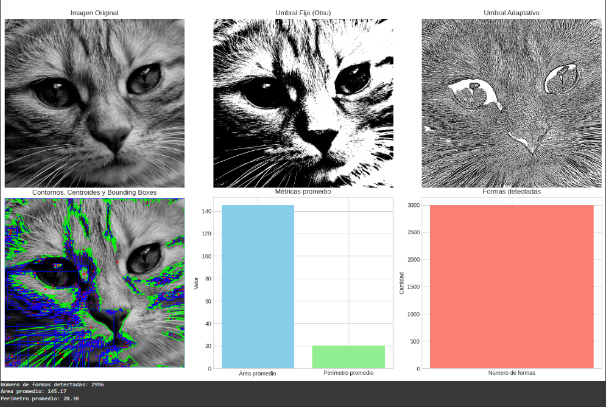

# 🧪 Segmentando el Mundo: Binarización y Reconocimiento de Formas

## [](#-fecha)📅 Fecha

`2025-05-01`

----------

## [](#-objetivo-del-taller)🎯 Objetivo del Taller

Este taller tiene como objetivo implementar técnicas fundamentales de procesamiento digital de imágenes utilizando Python y OpenCV. Se busca explorar los métodos de segmentación binaria, detección de contornos y extracción de características geométricas de los objetos presentes en imágenes en escala de grises.

----------

## [](#-conceptos-aprendidos)🧠 Conceptos Aprendidos


-   Segmentación de imágenes mediante técnicas de umbralización
-   Detección y análisis de contornos
-   Cálculo de propiedades geométricas (centroides, áreas, perímetros)
-   Visualización de resultados con Matplotlib
-   Procesamiento básico de imágenes con OpenCV
-   Cálculo de métricas estadísticas sobre los objetos detectados
----------

## [](#-herramientas-y-entornos)🔧 Herramientas y Entornos

-   Google Colab
- Python


----------

## [](#-estructura-del-proyecto)📁 Estructura del Proyecto

2025-05-01_taller_segmentacion_formas
├── python/
├── README.md


## 🧪 Implementación

### 🔹 Etapas realizadas

1.  **Preparación y carga de datos**: Carga de imágenes desde archivos locales o URLs.
2.  **Segmentación binaria**: Aplicación de umbralización fija (Otsu) y adaptativa.
3.  **Detección de contornos**: Identificación de objetos mediante la función `cv2.findContours()`.
4.  **Análisis de características**: Cálculo de centroides, bounding boxes, áreas y perímetros.
5.  **Visualización**: Representación gráfica de los resultados y métricas calculadas.

### 🔹 Código relevante

python

```python
# Segmentación binaria con umbralización
_, umbral_fijo = cv2.threshold(imagen, 0, 255, cv2.THRESH_BINARY + cv2.THRESH_OTSU)
umbral_adaptativo = cv2.adaptiveThreshold(
    imagen, 255, cv2.ADAPTIVE_THRESH_GAUSSIAN_C, cv2.THRESH_BINARY, 11, 2
)

# Detección de contornos
contornos, _ = cv2.findContours(imagen_binaria, cv2.RETR_EXTERNAL, cv2.CHAIN_APPROX_SIMPLE)

# Cálculo de centroide (centro de masa)
M = cv2.moments(contorno)
if M["m00"] != 0:
    cx = int(M["m10"] / M["m00"])
    cy = int(M["m01"] / M["m00"])
```
----------

## [](#-resultados-visuales)📊 Resultados Visuales


----------

## [](#-prompts-usados)🧩 Prompts Usados


Modelo Generativo Claude 3.7 Sonnet :
```
Desarrolla un script en Python para Google Colab usando OpenCV, Numpy y Matplotlib para procesar imágenes en escala de grises. El script debe cargar una imagen y luego realizar segmentación binaria de dos formas: primero, aplicando un umbral fijo con la función cv2.threshold(); y segundo, usando un umbral adaptativo con cv2.adaptiveThreshold(). Después, el código debe detectar los contornos presentes en la imagen binaria utilizando cv2.findContours(), y dibujar estos contornos sobre la imagen original con cv2.drawContours().

Debe calcular el centro de masa de cada forma detectada, usando la función cv2.moments(), que nos permitirá encontrar el centroide de los contornos. Además, el script tiene que calcular los bounding boxes de cada contorno, usando cv2.boundingRect(), y dibujarlos en la imagen original.

El código debe mostrar algunas métricas básicas: el número total de formas detectadas, el área promedio de estas formas y el perímetro promedio. Para visualizar los resultados, usa Matplotlib, mostrando las imágenes procesadas con los contornos, centros de masa y bounding boxes, junto con gráficos que muestren el número de formas, área promedio y perímetro promedio.

La entrada del script será una imagen en escala de grises, que puede ser cargada desde un archivo local o una URL las salidas deben ser tanto la imagen original con los contornos, centros de masa y bounding boxes, como las gráficas con las métricas mencionadas.


```

Modelo Generativo: GPT-4o
```

Genera un documento en formato Markdown que describa un taller de procesamiento de imágenes con OpenCV en Python, enfocándose en segmentación binaria, detección de contornos y análisis geométrico de objetos. El objetivo del taller es enseñar a usar Python y OpenCV para procesar imágenes, aplicar segmentación binaria, detectar contornos y calcular propiedades geométricas como centroides, áreas y perímetros.

Incluye los siguientes conceptos: segmentación mediante umbralización, detección de contornos, cálculo de propiedades geométricas (centroides, áreas, perímetros), y visualización de resultados con Matplotlib. Explica cómo cargar imágenes desde archivos locales o URLs, realizar segmentación binaria (umbralización fija y adaptativa), detectar contornos, calcular centroides, bounding boxes, áreas y perímetros, y finalmente, mostrar las imágenes procesadas y los resultados obtenidos.

Incluye un bloque de código que combine los pasos clave: conversión a escala de grises, segmentación binaria, detección de contornos y cálculo de propiedades geométricas.

Concluye con una reflexión personal sobre las técnicas aprendidas, destacando lo más útil o interesante, y posibles mejoras futuras. Añade instrucciones claras para reproducir el proyecto en Google Colab, explicando cómo instalar las dependencias, cargar imágenes y ejecutar el código paso a paso.


```
----------


## 💬 Reflexión Final


El desarrollo de este taller me permitió profundizar en la implementación práctica de conceptos fundamentales de procesamiento de imágenes. Aprendí la importancia de seleccionar los métodos de segmentación adecuados según las características de la imagen, y cómo las técnicas adaptativas pueden ofrecer mejores resultados en entornos con iluminación variable. Además, reforcé mi comprensión de las propiedades geométricas de los objetos en imágenes digitales y su interpretación matemática.

La parte más interesante fue observar cómo pequeños cambios en los parámetros de umbralización pueden afectar significativamente los resultados de la detección de contornos. El cálculo de momentos y su aplicación para determinar centroides resultó particularmente útil para comprender la distribución espacial de los objetos detectados.

Para futuros proyectos, me gustaría expandir este trabajo incorporando técnicas más avanzadas como clasificación de objetos mediante machine learning, segmentación semántica y seguimiento de objetos en secuencias de video. También sería valioso implementar métodos de preprocesamiento más robustos para mejorar la calidad de la segmentación en imágenes con ruido o bajo contraste.