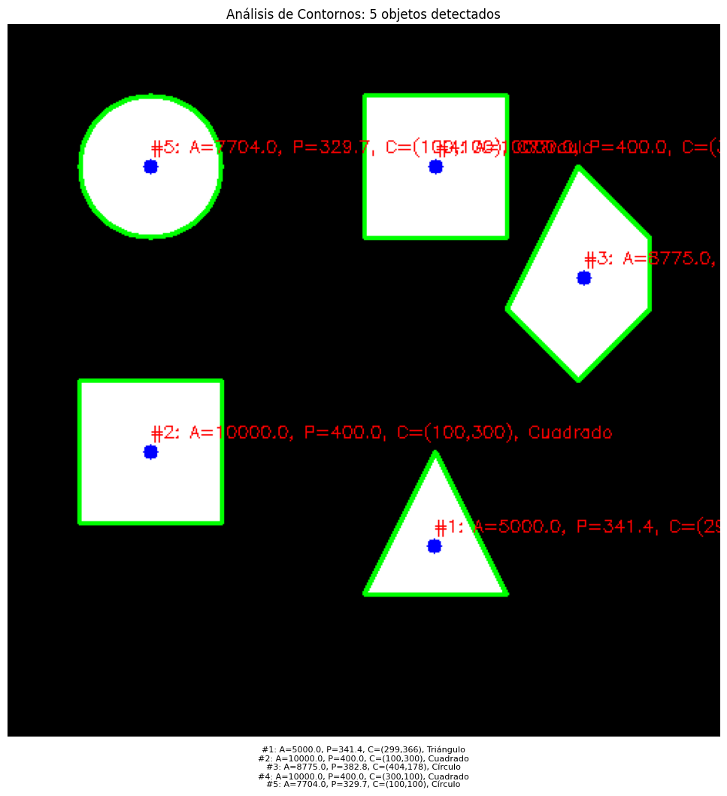

# 🧪 Análisis de Figuras Geométricas: Centroide, Área y Perímetro

## [](#-fecha)📅 Fecha

`2025-05-03`

----------

## [](#-objetivo-del-taller)🎯 Objetivo del Taller

Este taller tiene como objetivo explorar las técnicas básicas de procesamiento de imágenes para la detección, análisis y caracterización de contornos en imágenes binarizadas, utilizando OpenCV y Python. Se busca identificar objetos en una imagen, calcular sus propiedades geométricas y visualizar los resultados de manera clara y comprensible.

----------

## [](#-conceptos-aprendidos)🧠 Conceptos Aprendidos

-   ✅ Binarización de imágenes mediante umbralización
-   ✅ Detección de contornos con OpenCV
-   ✅ Cálculo de propiedades geométricas (área, perímetro)
-   ✅ Determinación de centroides mediante momentos
-   ✅ Anotación de imágenes con información relevante
-   ✅ Conversión entre espacios de color para visualización correcta
----------

## [](#-herramientas-y-entornos)🔧 Herramientas y Entornos

-   Google Colab
- Python


----------

## [](#-estructura-del-proyecto)📁 Estructura del Proyecto

├── python/
│   └── link.txt
├── image.png
├── README.md


## 🧪 Implementación


### 🔹 Etapas realizadas

1.  **Preparación de datos:**
    -   Carga de una imagen desde archivo o generación de una imagen sintética con formas básicas
    -   Conversión a escala de grises si es necesario
    -   Binarización mediante umbralización adaptativa
2.  **Aplicación del algoritmo:**
    -   Detección de contornos externos usando `cv2.findContours()`
    -   Cálculo de propiedades geométricas para cada contorno:
        -   Área usando `cv2.contourArea()`
        -   Perímetro usando `cv2.arcLength()`
        -   Centroides usando `cv2.moments()`
3.  **Visualización y anotación:**
    -   Dibujo de contornos sobre la imagen original
    -   Marcado de centroides
    -   Etiquetado de cada objeto con sus propiedades calculadas
    -   Conversión de BGR a RGB para visualización correcta con Matplotlib
4.  **Guardado de resultados:**
    -   Almacenamiento de la imagen binarizada
    -   Almacenamiento de la imagen con contornos y anotaciones

### 🔹 Código relevante

python

```python
# Detección de contornos en la imagen binarizada
contours, _ = cv2.findContours(binary_img, cv2.RETR_EXTERNAL, cv2.CHAIN_APPROX_SIMPLE)

# Procesamiento de cada contorno detectado
for i, contour in enumerate(contours):
    # Calcular propiedades geométricas
    area = cv2.contourArea(contour)
    perimeter = cv2.arcLength(contour, True)
    
    # Calcular el centroide usando momentos
    M = cv2.moments(contour)
    if M["m00"] != 0:
        cx = int(M["m10"] / M["m00"])
        cy = int(M["m01"] / M["m00"])
    else:
        cx, cy = 0, 0
        
    # Dibujar contorno y anotar información
    cv2.drawContours(result_img, [contour], -1, (0, 255, 0), 2)
    cv2.circle(result_img, (cx, cy), 5, (255, 0, 0), -1)
    label = f"#{i+1}: A={area:.1f}, P={perimeter:.1f}, C=({cx},{cy})"
    cv2.putText(result_img, label, (cx, cy - 10), 
                cv2.FONT_HERSHEY_SIMPLEX, 0.5, (0, 0
```

## [](#-resultados-visuales)📊 Resultados Visuales


----------

## [](#-prompts-usados)🧩 Prompts Usados


Modelo Generativo Claude 3.7 Sonnet :
```
Genera un código en Python utilizando las librerías opencv-python, numpy y matplotlib que cargue una imagen binarizada (ya sea desde un archivo o generada mediante umbralización con cv2.threshold()). Luego, detecta los contornos presentes en la imagen usando cv2.findContours() con el modo cv2.RETR_EXTERNAL y el método cv2.CHAIN_APPROX_SIMPLE. Para cada contorno detectado, calcula el área con cv2.contourArea(), el perímetro con cv2.arcLength() y el centroide utilizando los momentos obtenidos con cv2.moments(). Sobre una copia de la imagen original, dibuja cada contorno usando cv2.drawContours() y añade una etiqueta para cada figura que incluya el número del objeto, su área, su perímetro y las coordenadas del centroide. Finalmente, muestra la imagen procesada con las anotaciones usando matplotlib, asegurándote de convertirla de BGR a RGB para una visualización correcta.

```

Modelo Generativo: Gemini 2.0 Flash
```

Redacta lo siguiente para un README: el objetivo principal del taller, que se centra en explorar técnicas básicas de procesamiento de imágenes para la detección, análisis y caracterización de contornos en imágenes binarizadas utilizando OpenCV y Python, con el fin de identificar objetos, calcular sus propiedades geométricas y visualizar los resultados. Luego, enumera los conceptos principales que se aprenden en el taller, tales como la binarización de imágenes mediante umbralización, la detección de contornos con OpenCV, el cálculo de propiedades geométricas como el área y el perímetro, la determinación de centroides utilizando momentos, la técnica de anotación de imágenes con información relevante y la conversión entre espacios de color para una correcta visualización. A continuación, explica brevemente las etapas de implementación que se llevan a cabo en el taller, incluyendo la preparación de datos (carga o generación de imágenes, conversión a escala de grises si es necesario y binarización mediante umbralización adaptativa), la aplicación del algoritmo (detección de contornos externos con cv2.findContours(), cálculo de área con cv2.contourArea(), perímetro con cv2.arcLength() y centroides con cv2.moments()), la visualización y anotación (dibujo de contornos, marcado de centroides, etiquetado de cada objeto con sus propiedades calculadas y conversión de BGR a RGB para visualización con Matplotlib), y finalmente, el guardado de los resultados (almacenamiento de la imagen binarizada y de la imagen con contornos y anotaciones). Incluye también un fragmento de código relevante en Python que ilustre la detección de contornos, el cálculo de sus propiedades y la anotación de la imagen, utilizando las funciones de OpenCV mencionadas.

```
----------


## 💬 Reflexión Final

Este taller consolidó mi entendimiento del análisis de imágenes binarizadas, desde la binarización hasta la extracción y visualización de contornos. Reforcé el uso de OpenCV para detectar contornos y calcular área, perímetro y centroides mediante momentos. Anotar las imágenes con esta información demostró ser clave para interpretar los resultados claramente.

La detección y delimitación automática de objetos fue la parte más interesante. Sin embargo, la binarización en imágenes complejas podría ser un desafío futuro. Me gustaría explorar descriptores de forma y aplicar estas técnicas en escenarios más complejos como seguimiento de objetos o identificación de patrones, incluso considerando interfaces gráficas para una mejor interacción.