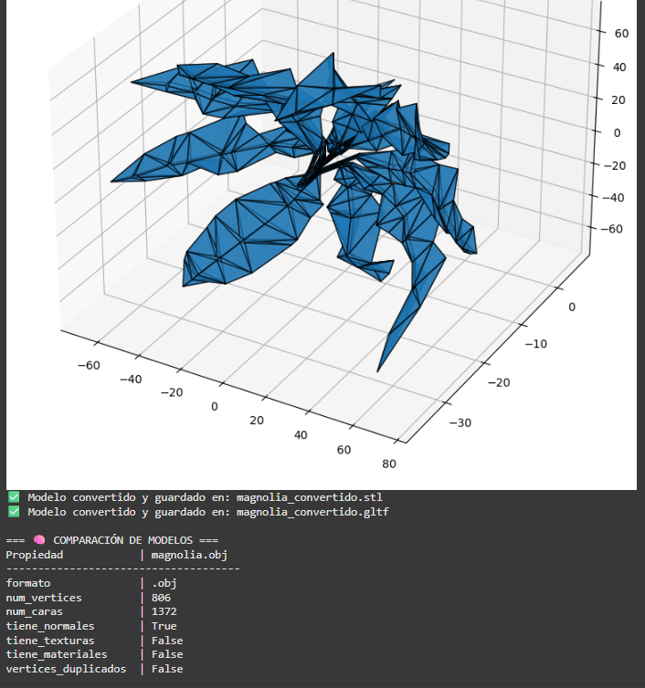

# 🧪 Taller - Importando el Mundo: Visualización y Conversión de Formatos 3D

  

## 📅 Fecha

  

2025-05-03

  

## 🎯 Objetivo del Taller

  

Este taller tiene como objetivo explorar técnicas para la manipulación, análisis y visualización de modelos 3D en diferentes formatos (`.OBJ`, `.STL`, `.GLTF`), utilizando Python con Trimesh y JavaScript con Three.js/React Three Fiber. Se busca entender la estructura interna de los modelos 3D, comparar sus propiedades geométricas, y visualizar las diferencias entre los distintos formatos de archivo.

  

## 🧠 Conceptos Aprendidos

  

✅ Carga y análisis de modelos 3D con Trimesh

✅ Cálculo de propiedades geométricas (vértices, caras, volumen, centro de masa)

✅ Detección de características de modelos (normales, texturas, materiales) ✅ Conversión entre formatos de modelos 3D (.OBJ, .STL, .GLTF)

✅ Visualización de modelos 3D en Python con Matplotlib

✅ Visualización interactiva con Three.js y React Three Fiber

✅ Comparación de rendimiento y fidelidad entre formatos 3D

  

## 🔧 Herramientas y Entornos

  

- Python (Google Colab/Jupyter Notebook)

- Trimesh

- NumPy

- Matplotlib

- JavaScript

- React

- Three.js

- React Three Fiber

- Drei

  

## 📁 Estructura del Proyecto

  

```

2025-05-03_taller_conversion_formatos_3d/

├── python/

│ └── model_analysis.py

├── threejs/

│ ├── src/

│ │ ├── App.jsx

│ │ ├── components/

│ │ │ ├── ModelViewer.jsx

│ │ │ ├── ModelSelector.jsx

│ │ │ └── ModelInfo.jsx

│ │ └── hooks/

│ │ └── useModelStats.js

│ └── public/

│ └── models/

│ ├── magnolia.obj

│ ├── magnolia.stl

│ └── magnolia.gltf

├── assets/

│ ├── python_visualization.gif

│ └── threejs_visualization.gif

└── README.md

```

  

## 🧪 Implementación

  

### 🔹 Etapas realizadas en Python

  

#### Preparación y carga de modelos:

  

- Instalación de dependencias (trimesh, numpy, matplotlib)

- Carga de modelos 3D usando `trimesh.load()`

- Gestión de diferentes tipos de entrada (Trimesh o Scene)

  

#### Análisis de propiedades:

  

- Extracción de información geométrica:

- Número de vértices y caras

- Verificación de normales y texturas

- Detección de vértices duplicados

- Cálculo de volumen y centro de masa

  

#### Conversión entre formatos:

  

- Transformación del modelo original a diferentes formatos (.STL, .GLTF)

- Utilización de `mesh.export()` con parámetros específicos

  

#### Visualización y comparación:

  

- Renderizado de modelos usando Matplotlib con proyección 3D

- Creación de visualizaciones con Poly3DCollection

- Comparación de propiedades entre modelos cargados

  

### 🔹 Etapas realizadas en Three.js

  

#### Configuración del entorno:

  

- Creación de componentes React para la visualización

- Implementación de un selector de modelos

- Configuración de una escena 3D con iluminación adecuada

  

#### Carga y visualización de modelos:

  

- Utilización de loaders específicos para cada formato

- Implementación de OrbitControls para navegación 3D

- Ajuste automático de cámara según el tamaño del modelo

  

#### Presentación de información:

  

- Visualización de estadísticas del modelo actual

- Interfaz para alternar entre formatos

- Comparación visual de renderizado y rendimiento

  

## 🔹 Código relevante (Python)

  

python

  

```python

def load_and_analyze_model(file_path):

"""

Carga un modelo 3D (ya sea Trimesh o Scene) y analiza sus propiedades.

"""

loaded = trimesh.load(file_path)

  

# Si es una escena, obtenemos la geometría combinada

if isinstance(loaded, trimesh.Scene):

if not loaded.geometry:

raise ValueError("La escena no contiene geometría")

mesh = trimesh.util.concatenate(tuple(loaded.geometry.values()))

else:

mesh = loaded

  

properties = {

"formato": os.path.splitext(file_path)[1],

"num_vertices": len(mesh.vertices),

"num_caras": len(mesh.faces),

"tiene_normales": mesh.vertex_normals is not None,

"tiene_texturas": hasattr(mesh.visual, 'uv') and mesh.visual.uv is not None,

"tiene_materiales": hasattr(mesh.visual, 'material') and mesh.visual.material is not None,

"vertices_duplicados": len(mesh.vertices) != len(np.unique(mesh.vertices, axis=0)),

"volumen": mesh.volume,

"centro_masa": mesh.center_mass.tolist() if hasattr(mesh, 'center_mass') else None,

}

  

return mesh, properties

  

def convert_format(mesh, output_path, format_type=None):

"""

Convierte un modelo a otro formato

"""

if format_type is None:

format_type = os.path.splitext(output_path)[1][1:]

  

if format_type.lower() == 'obj':

mesh.export(output_path, file_type='obj')

elif format_type.lower() == 'stl':

mesh.export(output_path, file_type='stl')

elif format_type.lower() in ['gltf', 'glb']:

mesh.export(output_path, file_type=format_type.lower())

else:

raise ValueError(f"Formato {format_type} no soportado")

  

print(f"✅ Modelo convertido y guardado en: {output_path}")

```

  

## 📊 Resultados Visuales

  

### Python - Visualización y Análisis

  



  

### Three.js - Visualización Interactiva

  


  

## 🧩 Prompts Usados

  

### Modelo Generativo Claude 3.7 Sonnet:

  

```

Crea un script en Python usando trimesh, numpy y matplotlib para cargar modelos 3D en

diferentes formatos (.obj, .stl, .gltf), analizar sus propiedades geométricas

(número de vértices, caras, presencia de normales, texturas y materiales), y

convertir entre formatos. Incluye funciones para visualizar los modelos con

matplotlib y comparar las propiedades de múltiples modelos. El script debe manejar

tanto objetos Trimesh como Scene, calculando volumen y centro de masa cuando sea posible.

```

  

### Modelo Generativo Claude 3.7 Sonnet:

  

```

Crea componentes React con React Three Fiber para visualizar modelos 3D en diferentes

formatos (.obj, .stl, .gltf). Incluye un selector para cambiar entre formatos, controles

de órbita para explorar los modelos, y un componente para mostrar estadísticas como

número de vértices y formato. Los componentes deben ser modulares, bien organizados y

fáciles de entender para un proyecto educativo sobre comparación de formatos 3D.

```

  

### Modelo Generativo Gemini 2.0 flash:

  

```

Genera un archivo README.md completo y bien estructurado para un taller titulado "🧪 Taller - Importando el Mundo: Visualización y Conversión de Formatos 3D" con fecha del 2025-05-04. El README debe incluir las siguientes secciones: un título llamativo, la fecha del taller, el objetivo principal, una lista de los conceptos aprendidos marcados con ✅, las herramientas y entornos utilizados (Python con Trimesh, NumPy, Matplotlib y JavaScript con React, Three.js, React Three Fiber y Drei), la estructura de un proyecto de ejemplo con directorios para python, threejs (con subdirectorios src, components, hooks y public/models), y assets (con ejemplos de GIFs de visualización), una sección detallada de la implementación dividida en etapas realizadas en Python y Three.js (describiendo las acciones clave en cada entorno), un fragmento de código relevante de Python para cargar, analizar y convertir modelos, una mención a los resultados visuales con placeholders para imágenes, y finalmente una sección de reflexión final que resuma las ideas clave, los desafíos encontrados y las futuras exploraciones.

  

```

  

## 💬 Reflexión Final

  

Este taller me permitió profundizar en la comprensión de los diferentes formatos de modelos 3D y sus características específicas. El uso de Trimesh en Python facilitó enormemente el análisis de propiedades geométricas, mientras que la implementación en React Three Fiber ofreció una perspectiva práctica sobre cómo estos formatos se comportan en un entorno web.

  

La parte más interesante fue observar cómo cada formato tiene ventajas y desventajas: mientras que `.OBJ` preserva mejor las texturas y coordenadas UV, `.STL` resulta más simple y robusto para ciertos usos, y `.GLTF` ofrece un equilibrio excelente para aplicaciones web con su soporte para materiales, animaciones y optimizaciones.

  

Un desafío importante fue la gestión de escala y orientación al convertir entre formatos, ya que cada formato puede manejar estos aspectos de manera diferente. También fue revelador comparar el rendimiento de carga y visualización entre los diferentes formatos, especialmente en el entorno web donde la eficiencia es crucial.

  

Para futuras exploraciones, me gustaría profundizar en la compresión de mallas (mesh compression) y la optimización de modelos para entornos web y dispositivos móviles, así como explorar la integración con tecnologías AR/VR donde la eficiencia y fidelidad visual deben equilibrarse cuidadosamente.