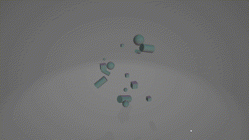

# 🧪 Taller - Escenas Paramétricas: Creación de Objetos desde Datos

## 📅 Fecha

2025-05-05

## 🎯 Objetivo del Taller

Este taller tiene como objetivo explorar técnicas para la generación programática de objetos 3D a partir de datos estructurados, utilizando Python con vedo/trimesh/open3d y JavaScript con React Three Fiber. Se busca entender cómo crear geometría en tiempo real y de forma flexible mediante código, utilizando bucles, estructuras condicionales y exportando o renderizando las escenas generadas.

## 🧠 Conceptos Aprendidos

✅ Generación de puntos en el espacio 3D con distribuciones aleatorias
✅ Creación programática de primitivas 3D (esferas, cubos, cilindros)
✅ Transformación de datos a representaciones geométricas
✅ Parametrización de objetos (posición, escala, color, rotación)
✅ Visualización interactiva con controles dinámicos
✅ Exportación de escenas a formatos estándar (.OBJ, .STL, .GLTF)
✅ Manipulación de datos en tiempo real con interfaces interactivas

## 🔧 Herramientas y Entornos

- Python (Google Colab/Jupyter Notebook)
- vedo
- trimesh
- open3d
- NumPy
- JavaScript
- React
- React Three Fiber
- Drei
- Leva (control de parámetros)

## 📁 Estructura del Proyecto

```
2025-05-05_taller_escenas_parametricas/
├── python/
│   ├── link.txt
│   ├── demo.gif
│   └── resultados/
│       ├── escena_vedo_0.obj
│       └── escena_vedo_1.obj
│
├── threejs/
│   ├── src/
│   │   ├── App.jsx
│   │   ├── components/
│   │   │   └── DataVisualizer.jsx
│   │   └── utils/
│   │       └── dataGenerator.js
│
└── README.md
```

## 🧪 Implementación

### 🔹 Etapas realizadas en Python

#### Generación de datos:

- Creación de puntos aleatorios en el espacio 3D
- Configuración de parámetros para primitivas
- Estructuración de datos para uso posterior

#### Creación de objetos:

- Generación condicional de primitivas (esferas, cubos, cilindros)
- Aplicación de transformaciones basadas en los datos
- Asignación de colores y propiedades visuales

#### Visualización y exportación:

- Renderizado de la escena con vedo
- Exportación a formatos estándar (.OBJ)
- Visualización interactiva de los resultados

#### Procesamiento avanzado:

- Lectura de datos desde archivos CSV para automatizar la generación
- Transformación de datos tabulares en representaciones 3D
- Creación de escenas complejas con múltiples tipos de objetos

### 🔹 Etapas realizadas en React Three Fiber

#### Configuración del entorno:

- Creación de componentes React para la visualización 3D
- Implementación de controles interactivos con Leva
- Configuración de iluminación y cámara

#### Visualización de datos:

- Transformación de arrays de datos en objetos 3D
- Aplicación de layouts diferentes (circular, grid, spiral)
- Parametrización dinámica de propiedades visuales

#### Interactividad:

- Implementación de controles de órbita para exploración
- Regeneración dinámica de datos
- Ajuste de parámetros en tiempo real

## 🔹 Código relevante (Python)

```python
def crear_primitivas_vedo(puntos):
    """Crea primitivas 3D usando vedo basado en los puntos proporcionados"""
    objetos = []
    colores = vedo.colors.cmaps_names

    for i, punto in enumerate(puntos):
        # Aplicar condicionales para variar parámetros
        if i % 3 == 0:  # Cada tercer punto es una esfera
            radio = 0.2 + (i * 0.05)  # Tamaño variable
            esfera = vedo.Sphere(pos=punto, r=radio, c=random.choice(colores))
            objetos.append(esfera)
        elif i % 3 == 1:  # Cada tercer punto + 1 es un cubo
            lado = 0.3 + (i * 0.04)  # Tamaño variable
            cubo = vedo.Cube(pos=punto, side=lado, c=random.choice(colores))
            objetos.append(cubo)
        else:  # Cada tercer punto + 2 es un cilindro
            radio = 0.15 + (i * 0.03)
            altura = 0.5 + (i * 0.1)
            # Orientación aleatoria para el cilindro
            punto_final = punto + np.array([random.uniform(-1,1), random.uniform(-1,1), altura])
            cilindro = vedo.Cylinder(pos=[punto, punto_final], r=radio, c=random.choice(colores))
            objetos.append(cilindro)

    return objetos
```

## 🔹 Código relevante (React Three Fiber)

```javascript
// Función para determinar la posición basada en el layout
const getPosition = (index, total) => {
  const angle = (index / total) * Math.PI * 2;
  
  switch (layout) {
    case 'circular':
      const radius = 10;
      return [
        Math.sin(angle) * radius,
        0,
        Math.cos(angle) * radius
      ];
    
    case 'grid':
      const gridSize = Math.ceil(Math.sqrt(total));
      const gridX = (index % gridSize) - gridSize / 2;
      const gridZ = Math.floor(index / gridSize) - gridSize / 2;
      return [gridX * 4, 0, gridZ * 4];
    
    case 'spiral':
      const spiralRadius = (index / total) * 10 + 2;
      return [
        Math.sin(angle * 3) * spiralRadius,
        0,
        Math.cos(angle * 3) * spiralRadius
      ];
      
    default:
      return [0, 0, 0];
  }
};
```

## 📊 Resultados Visuales

### Python - Visualización y Exportación



### React Three Fiber - Visualización Interactiva


## 🧩 Prompts Usados

### Modelo Generativo Claude 3.7 Sonnet:

```
Crea un script en Python usando vedo, trimesh, open3d y numpy para generar objetos 3D paramétricos 
a partir de datos aleatorios. El script debe generar puntos en el espacio 3D, luego crear diferentes
primitivas (esferas, cubos, cilindros) en esas posiciones, usando bucles y condicionales para 
variar los parámetros como tamaño y color. Incluye funciones para visualizar la escena y exportar
los objetos a formato OBJ. Añade un bonus para importar datos desde un archivo CSV para generar
objetos.
```

### Modelo Generativo Claude 3.7 Sonnet:

```
Crea un componente React con React Three Fiber llamado DataVisualizer que visualice un array de
datos como objetos 3D. El componente debe permitir cambiar entre diferentes layouts (circular,
grid, spiral), tipos de geometría (box, sphere, cone, torus), y modos de color. Utiliza leva para
crear controles interactivos que permitan ajustar escalas, velocidad de rotación y otros parámetros
visuales. El componente debe ser modular y reutilizable para diferentes conjuntos de datos.
```

## 💬 Reflexión Final

Este taller me permitió explorar la intersección entre datos y representaciones visuales 3D, revelando cómo la parametrización permite generar escenas complejas a partir de estructuras de datos simples. El uso de vedo en Python proporcionó una forma sencilla pero potente de generar y exportar geometría, mientras que React Three Fiber demostró ser una excelente herramienta para visualizaciones interactivas en entornos web.

La parte más interesante fue descubrir cómo las mismas estructuras de datos pueden representarse de formas radicalmente diferentes cambiando los parámetros de visualización, y cómo los layouts y esquemas de color pueden revelar patrones diferentes en los mismos datos.

Un desafío importante fue diseñar sistemas que fueran lo suficientemente flexibles para manejar diferentes tipos de datos de entrada, manteniendo al mismo tiempo un rendimiento óptimo con grandes cantidades de objetos. También fue revelador encontrar formas eficientes de transformar datos tabulares en representaciones espaciales significativas.

Para futuras exploraciones, me gustaría profundizar en técnicas más avanzadas como la generación procedural de geometría compleja, la animación basada en datos temporales, y la integración de estas técnicas con campos como la visualización científica o la creación de entornos virtuales generativos para aplicaciones educativas o artísticas.