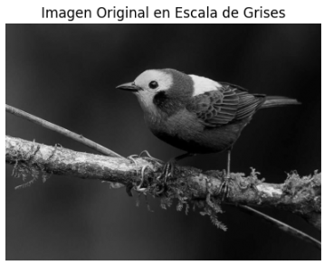
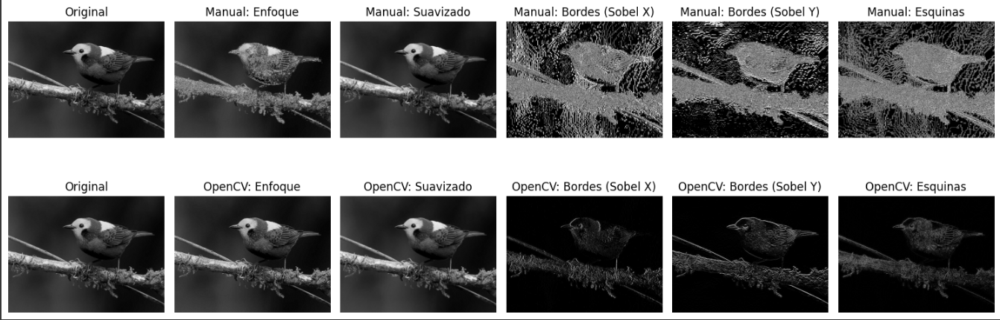

# 🧪 Taller - Filtro Visual: Convoluciones Personalizadas

## 📅 Fecha

2025-05-05

## 🎯 Objetivo del Taller

Este taller tiene como objetivo explorar y comprender el concepto de convolución 2D para el procesamiento de imágenes, implementando manualmente filtros personalizados y comparándolos con las implementaciones de OpenCV. Se busca entender cómo diferentes kernels pueden modificar bordes, difuminar o realzar detalles en imágenes digitales.

## 🧠 Conceptos Aprendidos

✅ Implementación manual de una convolución 2D usando NumPy
✅ Diseño y aplicación de kernels personalizados (enfoque, suavizado, detección de bordes)
✅ Comparación entre implementaciones manuales y las funciones optimizadas de OpenCV
✅ Visualización comparativa de resultados de procesamiento de imágenes
✅ Creación de interfaces interactivas para experimentar con parámetros de kernel
✅ Manipulación de imágenes usando operaciones matemáticas matriciales
✅ Entendimiento del padding y gestión de bordes en convoluciones

## 🔧 Herramientas y Entornos

- Python (Google Colab/Jupyter Notebook)
- NumPy
- OpenCV (cv2)
- Matplotlib
- ipywidgets (para interactividad)
- Google Colab (entorno de ejecución)

## 📁 Estructura del Proyecto

```
2025-05-05_taller_convoluciones_personalizadas/
├── python/
   └── link.txt
    ├── imagen_original.jpg
    ├── comparacion_filtros.gif
    └── interfaz_interactiva.gif
    └── README.md
```

## 🧪 Implementación

### 🔹 Etapas realizadas en Python

#### Preparación y carga de imágenes:

- Descarga y carga de una imagen de ejemplo
- Conversión a escala de grises para simplificar el procesamiento
- Visualización de la imagen original como referencia

#### Implementación manual de convolución 2D:

- Creación de una función de convolución desde cero usando NumPy
- Gestión de padding (relleno) para manejar los bordes de la imagen
- Aplicación pixel por pixel del kernel a la imagen completa
- Normalización de resultados para mantener el rango de valores adecuado

#### Diseño de kernels personalizados:

- Kernel de enfoque (sharpening) para resaltar detalles
- Kernel de suavizado (blur) para reducir ruido
- Kernels de detección de bordes (Sobel horizontal y vertical)
- Kernel de detección de esquinas (derivadas cruzadas)

#### Comparación visual con OpenCV:

- Aplicación de los mismos kernels usando la función optimizada `cv2.filter2D()`
- Visualización comparativa entre resultados manuales y OpenCV
- Análisis de diferencias y similitudes entre ambos enfoques

#### Creación de interfaz interactiva:

- Desarrollo de sliders para modificar valores del kernel en tiempo real
- Visualización dinámica de resultados al modificar parámetros
- Presentación del kernel utilizado en cada momento

## 🔹 Código relevante (Python)

```python
# Implementación manual de convolución 2D
def convolucion_manual(imagen, kernel):
    # Obtener dimensiones
    alto_img, ancho_img = imagen.shape
    alto_k, ancho_k = kernel.shape

    # Calcular padding
    pad_y = alto_k // 2
    pad_x = ancho_k // 2

    # Crear imagen con padding usando NumPy
    imagen_pad = np.pad(imagen, ((pad_y, pad_y), (pad_x, pad_x)), mode='reflect')

    # Crear imagen de salida
    salida = np.zeros_like(imagen)

    # Aplicar convolución
    for y in range(alto_img):
        for x in range(ancho_img):
            # Extraer región de interés
            region = imagen_pad[y:y+alto_k, x:x+ancho_k]
            # Aplicar kernel
            salida[y, x] = np.sum(region * kernel)

    # Normalizar valores para mantenerlos en el rango 0-255
    salida = np.clip(salida, 0, 255).astype(np.uint8)

    return salida
```

```python
# Kernels de ejemplo
def definir_kernels():
    # Kernel para enfoque (sharpening)
    kernel_enfoque = np.array([
        [0, -1, 0],
        [-1, 5, -1],
        [0, -1, 0]
    ])

    # Kernel para suavizado (blur)
    kernel_suavizado = np.array([
        [1/9, 1/9, 1/9],
        [1/9, 1/9, 1/9],
        [1/9, 1/9, 1/9]
    ])

    # Kernel para detección de bordes (Sobel horizontal)
    kernel_sobel_x = np.array([
        [-1, 0, 1],
        [-2, 0, 2],
        [-1, 0, 1]
    ])

    # Kernel para detección de bordes (Sobel vertical)
    kernel_sobel_y = np.array([
        [-1, -2, -1],
        [0, 0, 0],
        [1, 2, 1]
    ])

    # Kernel para detección de esquinas (derivadas cruzadas)
    kernel_esquinas = np.array([
        [-1, -1, -1],
        [-1,  8, -1],
        [-1, -1, -1]
    ])

    return {
        'Enfoque': kernel_enfoque,
        'Suavizado': kernel_suavizado,
        'Bordes (Sobel X)': kernel_sobel_x,
        'Bordes (Sobel Y)': kernel_sobel_y,
        'Esquinas': kernel_esquinas
    }
```

```python
# Interfaz interactiva
def crear_interfaz_interactiva_colab(imagen):
    def aplicar_kernel(centro=50, alrededores=10):
        clear_output(wait=True)

        # Crear kernel dinámico
        kernel = np.ones((3, 3)) * (-alrededores / 10)
        kernel[1, 1] = centro / 10

        # Aplicar el filtro a la imagen
        resultado = cv2.filter2D(imagen, -1, kernel)

        # Mostrar imagen resultante
        plt.figure(figsize=(5, 5))
        plt.imshow(resultado, cmap='gray')
        plt.title(f"Centro: {centro / 10:.1f}, Alred: {-alrededores / 10:.1f}")
        plt.axis('off')
        plt.show()

        # Mostrar el kernel usado
        print("Kernel actual:")
        print(np.round(kernel, 2))

    # Crear sliders interactivos
    print("Ajusta los valores del kernel con los sliders:")
    interact(
        aplicar_kernel,
        centro=IntSlider(min=0, max=100, step=1, value=50, description='Centro'),
        alrededores=IntSlider(min=0, max=100, step=1, value=10, description='Alred.')
    )
```

## 📊 Resultados Visuales

### Imagen Original



### Comparación de Filtros



### Interfaz Interactiva


## 🧩 Prompts Usados

### Modelo Generativo Claude 3.7 Sonnet:

```
Crea un script en Python que implemente manualmente una convolución 2D para procesamiento de imágenes.
El script debe incluir:
1. Una función que cargue una imagen y la convierta a escala de grises
2. Una implementación desde cero de la operación de convolución 2D usando NumPy
3. Al menos 5 kernels diferentes: para enfoque (sharpening), suavizado (blur), detección de bordes
   horizontales y verticales (Sobel), y detección de esquinas
4. Una función para comparar visualmente los resultados de la convolución manual con la
   implementación de OpenCV (cv2.filter2D)
5. Una interfaz interactiva usando ipywidgets que permita modificar dinámicamente los valores
   del kernel y ver los resultados en tiempo real

El código debe estar bien documentado y estructurado para un taller educativo sobre
convoluciones y filtros de imágenes.
```

### Modelo Generativo Claude 3.7 Sonnet:

```
Genera un conjunto completo de kernels de convolución para procesamiento de imágenes, 
incluyendo ejemplos para:
- Filtros de suavizado (box blur, gaussian blur)
- Filtros de enfoque (sharpening)
- Detección de bordes (diferentes variantes de Sobel, Prewitt, Laplacian)
- Detección de esquinas
- Emboss (efecto relieve)

Para cada kernel, proporciona una matriz NumPy con los valores exactos y una breve
explicación de su efecto visual sobre la imagen. Incluye también sugerencias para
el tamaño ideal de cada kernel y si requieren normalización.
```

## 💬 Reflexión Final

Este taller me permitió comprender a fondo el funcionamiento de las convoluciones 2D y su impacto visual en el procesamiento de imágenes. La implementación manual de la convolución reveló la complejidad computacional detrás de operaciones que normalmente damos por sentado al usar bibliotecas como OpenCV.

La parte más fascinante fue observar cómo kernels relativamente simples (matrices 3x3) pueden transformar completamente el aspecto visual de una imagen, desde suavizar detalles hasta resaltar bordes específicos. Particularmente interesante resultó entender cómo el kernel de detección de esquinas combina efectivamente información de gradientes en múltiples direcciones.

Un desafío importante fue la gestión adecuada de los bordes de la imagen mediante técnicas de padding. Descubrí que diferentes modos de padding (reflect, constant, symmetric) pueden generar artefactos visuales distintos en los bordes de las imágenes procesadas.

Para futuras exploraciones, me gustaría profundizar en filtros más complejos como los gaussianos con tamaños variables, filtros de mediana para eliminación de ruido, y técnicas avanzadas como la convolución separable para optimizar el rendimiento computacional en kernels que pueden descomponerse en operaciones unidimensionales.