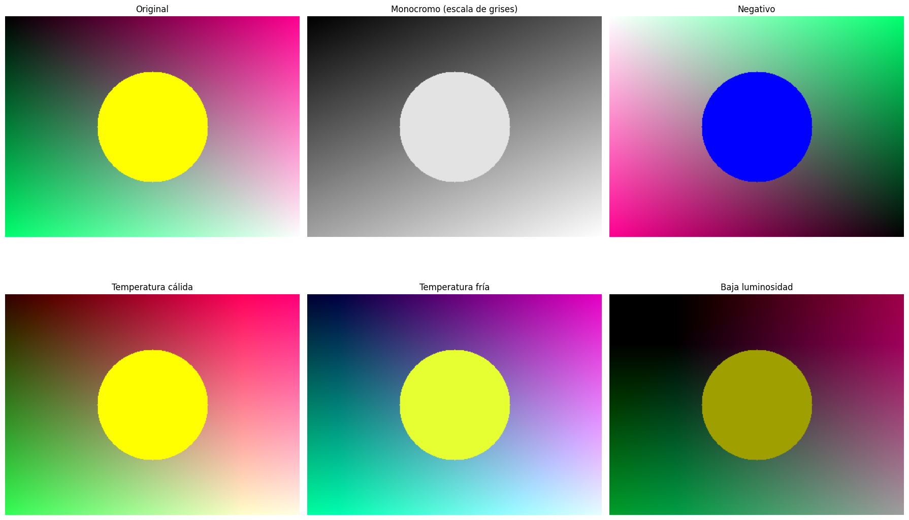
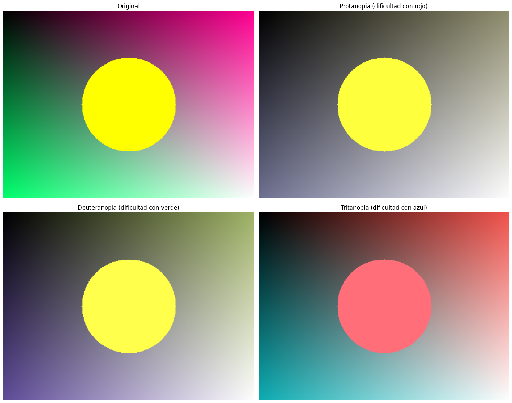
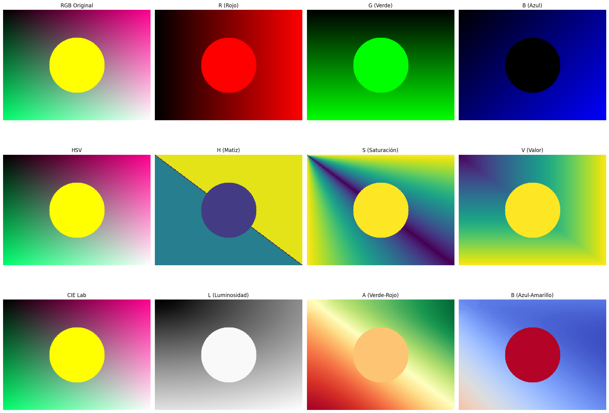

#  🧪 Taller - Explorando el Color: Percepción Humana y Modelos Computacionales

  

##  📅 Fecha

  

2025-05-16

  

##  🌷 Equipo de trabajo

  

**Mi grupo está conformado por:**

  

- Julián Ramírez Díaz (julramirezdi@unal.edu.co)

- Xamir Ernesto Rojas Gamboa (xerojasga@unal.edu.co)

- Julián David Rincón Orjuela (jurinconor@unal.edu.co)

- María Fernanda Cala Rodríguez (mcalar@unal.edu.co)

  

**Este taller fue realizado por:**

- María Fernanda Cala Rodríguez (mcalar@unal.edu.co)

  

##  🎯 Objetivo del Taller

  

Este taller tiene como objetivo investigar la percepción del color desde el punto de vista humano y computacional, y representar visualmente las diferencias entre modelos de color. Buscamos comprender cómo los distintos espacios de color (RGB, HSV, CIE Lab) afectan la interpretación visual y cómo pueden aplicarse transformaciones para simular condiciones específicas como daltonismo o cambios de iluminación.

  

##  🧠 Conceptos Aprendidos

  

✅ Estructura interna de diferentes modelos de color (RGB, HSV, CIE Lab)

✅ Transformación y conversión entre espacios de color

✅ Análisis de canales individuales y su contribución a la imagen final

✅ Simulación de alteraciones de la visión (daltonismo, baja luminosidad)

✅ Aplicación de transformaciones de color para efectos visuales

✅ Creación de interfaces interactivas para explorar el color

✅ Relación entre la percepción humana y la representación digital del color

  

##  🔧 Herramientas y Entornos

  

- Python (Google Colab/Jupyter Notebook)

- OpenCV (`cv2`)

- NumPy

- Matplotlib

- Scikit-image

- ColorsyS

  

##  📁 Estructura del Proyecto

  

```

2025-05-16_taller_explorando_color/

├── python/

│ └── link.txt

└── README.md

```

  

##  🧪 Implementación

  

###  🔹 Funcionalidades Desarrolladas

  

####  Carga y visualización:

- Carga de imágenes usando OpenCV

- Visualización con Matplotlib

- Análisis de canales individuales en diferentes modelos de color

  

####  Conversiones entre modelos:

- RGB → HSV: separando color en matiz, saturación y valor

- RGB → CIE Lab: modelo perceptual basado en la visión humana

- Visualización comparativa de los diferentes canales

  

####  Simulaciones de alteraciones visuales:

- Daltonismo mediante matrices de transformación:

- Protanopía (deficiencia de conos rojos)

- Deuteranopía (deficiencia de conos verdes)

- Tritanopía (deficiencia de conos azules)

- Ajustes de brillo y contraste

- Filtros de temperatura de color (cálido/frío)

  

####  Herramientas interactivas:

- Interface con controles deslizantes para manipular parámetros de color

- Visualización en tiempo real de los cambios

- Comparación simultánea de diferentes modelos de color

  

##  🔹 Código Relevante

  

Este fragmento de código muestra la implementación de la simulación de daltonismo:

  

```python

def  simulate_color_blindness(img,  type_of_colorblindness):

"""Simula diferentes tipos de daltonismo."""

# Conversión de matrices aproximadas para los diferentes tipos de daltonismo

if type_of_colorblindness ==  "protanopia":  # Dificultad con el rojo

matrix = np.array([

[0.567,  0.433,  0.0],

[0.558,  0.442,  0.0],

[0.0,  0.242,  0.758]

])

elif type_of_colorblindness ==  "deuteranopia":  # Dificultad con el verde

matrix = np.array([

[0.625,  0.375,  0.0],

[0.7,  0.3,  0.0],

[0.0,  0.3,  0.7]

])

elif type_of_colorblindness ==  "tritanopia":  # Dificultad con el azul

matrix = np.array([

[0.95,  0.05,  0.0],

[0.0,  0.433,  0.567],

[0.0,  0.475,  0.525]

])

else:

return img

# Crear una imagen de resultado

result = np.zeros_like(img,  dtype=float)

# Aplicar la matriz de transformación

for i in  range(img.shape[0]):

for j in  range(img.shape[1]):

rgb = img[i, j].astype(float)

result[i, j]  = np.dot(matrix, rgb)

# Asegurar que los valores estén en el rango correcto

result = np.clip(result,  0,  255).astype(np.uint8)

return result

```

  

##  📊 Resultados Visuales

  







  
  

##  🧩 Prompts Usados

  

###  Modelo Generativo Claude 3.7 Sonnet:

  

```

Crea un script en Python usando OpenCV, NumPy y Matplotlib para el análisis

y visualización de modelos de color. El script debe permitir:

1. Cargar imágenes y convertirlas entre espacios RGB, HSV y CIE Lab

2. Visualizar los canales individuales de cada modelo

3. Implementar simulaciones de daltonismo (protanopía, deuteranopía, tritanopía)

4. Aplicar transformaciones de color como ajustes de brillo/contraste y temperatura

5. Crear una interfaz interactiva para explorar estos cambios en tiempo real

Incluye funciones documentadas y un ejemplo de uso con una imagen sintética generada

por código para demostrar todas las funcionalidades.

```

  

###  Modelo Generativo Claude 3.7 Sonnet:

  

```

Crea un README.md completo para un taller titulado "Explorando el Color:

Percepción Humana y Modelos Computacionales". El README debe incluir:

1. Descripción del objetivo del taller

2. Lista de conceptos aprendidos

3. Herramientas utilizadas (Python, OpenCV, Matplotlib, etc.)

4. Estructura de archivos del proyecto

5. Explicación detallada de la implementación

6. Un fragmento relevante de código explicando la simulación de daltonismo

7. Descripción de los resultados visuales con referencias a imágenes

8. Los prompts utilizados para generar el código y el README

9. Una reflexión final sobre la importancia de comprender los modelos de color

Usa emojis para los títulos de sección y asegúrate de que el formato sea claro y visualmente atractivo.

```

  

##  💬 Reflexión Final

  

Este taller me permitió profundizar en la comprensión de cómo las computadoras representan el color y cómo esta representación se relaciona con la percepción humana. La exploración de diferentes espacios de color reveló que no hay un modelo "perfecto" para todas las aplicaciones: RGB resulta intuitivo para la generación digital, HSV facilita la selección de colores, y CIE Lab ofrece una representación más cercana a cómo percibimos los colores.

  

La simulación de daltonismo fue particularmente reveladora, mostrando cómo el diseño de interfaces y visualizaciones debe considerar la accesibilidad para diferentes tipos de percepción visual. Las matrices de transformación utilizadas proporcionan una aproximación útil, aunque simplificada, de cómo perciben el mundo personas con diferentes tipos de daltonismo.

  

Para futuras exploraciones, sería interesante:

- Implementar algoritmos de armonía de color y teoría del color

- Explorar modelos de color más avanzados como CIECAM02

- Investigar algoritmos de corrección de color para mejorar la accesibilidad

- Desarrollar herramientas que automaticen el diseño de paletas de color accesibles

  

La comprensión profunda de los modelos de color no solo mejora nuestras capacidades técnicas, sino que nos permite crear experiencias visuales más inclusivas y efectivas para todos los usuarios.