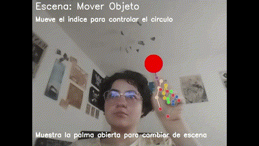
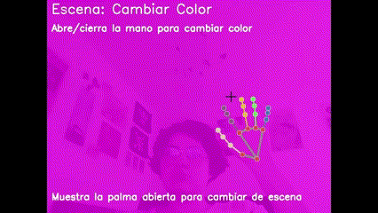

# 🧪 Taller - Gestos con Cámara Web: Control Visual con MediaPipe

## 📅 Fecha

2025-05-17

## 🌷 Equipo de trabajo

**Mi grupo está conformado por:**

- Julián Ramírez Díaz (julramirezdi@unal.edu.co)
- Xamir Ernesto Rojas Gamboa (xerojasga@unal.edu.co)
- Julián David Rincón Orjuela (jurinconor@unal.edu.co)
- María Fernanda Cala Rodríguez (mcalar@unal.edu.co)

**Este taller fue realizado por:**
- María Fernanda Cala Rodríguez (mcalar@unal.edu.co)

## 🎯 Objetivo del Taller

Este taller tiene como objetivo explorar las interfaces naturales de usuario mediante la detección de gestos con las manos utilizando la cámara web. A través de la biblioteca MediaPipe y OpenCV, desarrollamos un sistema capaz de reconocer gestos en tiempo real y traducirlos en acciones visuales, creando una experiencia interactiva sin necesidad de hardware especializado.

## 🧠 Conceptos Aprendidos

✅ Procesamiento de video en tiempo real con OpenCV
✅ Implementación de la detección de manos con MediaPipe
✅ Reconocimiento de gestos y posturas de la mano
✅ Medición de distancias entre puntos de referencia (landmarks)
✅ Conteo de dedos extendidos
✅ Creación de interfaces naturales de usuario (NUI)
✅ Aplicación de transformaciones visuales basadas en gestos
✅ Desarrollo de una máquina de estados para manejar diferentes escenas interactivas

## 🔧 Herramientas y Entornos

- Python
- OpenCV (`cv2`)
- MediaPipe
- NumPy
- Google Colab/Jupyter Notebook

## 📁 Estructura del Proyecto

```
2025-05-17_taller_gestos_webcam_mediapipe/
├── python/
│   └── taller13.ipynb
└── README.md
```

## 🧪 Implementación

### 🔹 Funcionamiento de MediaPipe Hands

MediaPipe Hands es una solución de machine learning que permite la detección y el seguimiento de manos en tiempo real. El sistema funciona mediante los siguientes pasos:

1. **Detección inicial**: Localiza la mano en la imagen completa
2. **Seguimiento**: Predice la ubicación de 21 puntos de referencia (landmarks) de la mano
3. **Representación**: Cada punto tiene coordenadas (x, y, z) normalizadas, donde:
   - x e y son coordenadas de 0 a 1 relativas al ancho y alto de la imagen
   - z representa la profundidad relativa (siendo 0 la muñeca)


### 🔹 Gestos implementados

El sistema implementa los siguientes gestos y acciones:

1. **Cambio de escena**: Mostrar la palma abierta (4-5 dedos extendidos)
2. **Mover objeto**: Seguimiento de la punta del dedo índice
3. **Cambiar color de fondo**: Basado en el número de dedos extendidos
4. **Dibujar**: Acercar las puntas del dedo índice y pulgar ("pinza")

### 🔹 Interacción en tiempo real





## 🔹 Código Relevante

Este fragmento muestra cómo detectamos los dedos extendidos para interpretar gestos:

```python
def count_fingers_extended(self, hand_landmarks):
    # Puntos de referencia de las puntas de los dedos
    finger_tips = [
        self.mp_hands.HandLandmark.THUMB_TIP,
        self.mp_hands.HandLandmark.INDEX_FINGER_TIP,
        self.mp_hands.HandLandmark.MIDDLE_FINGER_TIP,
        self.mp_hands.HandLandmark.RING_FINGER_TIP,
        self.mp_hands.HandLandmark.PINKY_TIP
    ]
    # Puntos de referencia de las articulaciones intermedias
    finger_pips = [
        self.mp_hands.HandLandmark.THUMB_IP,
        self.mp_hands.HandLandmark.INDEX_FINGER_PIP,
        self.mp_hands.HandLandmark.MIDDLE_FINGER_PIP,
        self.mp_hands.HandLandmark.RING_FINGER_PIP,
        self.mp_hands.HandLandmark.PINKY_PIP
    ]
    
    count = 0
    # Para el pulgar, criterio diferente
    thumb_tip = hand_landmarks.landmark[finger_tips[0]]
    thumb_base = hand_landmarks.landmark[self.mp_hands.HandLandmark.THUMB_CMC]
    if thumb_tip.x < thumb_base.x:  # Simplificado para mano derecha
        count += 1
    
    # Para los demás dedos
    for i in range(1, 5):
        tip = hand_landmarks.landmark[finger_tips[i]]
        pip = hand_landmarks.landmark[finger_pips[i]]
        
        # Si la punta está más arriba que la articulación, el dedo está extendido
        if tip.y < pip.y:
            count += 1
            
    return count
```

## 🧩 Prompts Usados

### Prompt 1: Generación del código base con MediaPipe

```
Crea un script en Python para detectar gestos con las manos utilizando MediaPipe y OpenCV. 
El programa debe:
1. Capturar video desde la webcam
2. Detectar las manos utilizando MediaPipe Hands
3. Implementar tres escenas distintas controladas por gestos:
   - Una escena donde se pueda mover un objeto siguiendo la punta del dedo índice
   - Una escena donde el número de dedos extendidos cambie el color de fondo
   - Una escena donde acercar el pulgar e índice permita dibujar en pantalla
4. Permitir cambiar entre escenas mostrando la palma abierta
5. Incluir instrucciones en pantalla
6. Utilizar una estructura orientada a objetos bien organizada con comentarios claros
```

### Prompt 2: Generación del README detallado

```
Crea un README.md completo para un taller titulado "Gestos con Cámara Web: Control Visual con MediaPipe". 
El README debe incluir:
1. Título, fecha y equipo de trabajo
2. Objetivo del taller claramente definido
3. Lista de conceptos aprendidos con emojis de verificación
4. Herramientas y entornos utilizados
5. Estructura del proyecto
6. Explicación del funcionamiento de MediaPipe Hands
7. Descripción de los gestos implementados
8. Secciones para GIFs de demostración
9. Un fragmento relevante de código comentado
10. La lista de prompts utilizados para generar el código
11. Una reflexión final sobre la experiencia y posibles mejoras
Todo debe mantener un formato atractivo con emojis apropiados para cada sección.
```

### Prompt 3: Mejoras específicas para el reconocimiento de gestos

```
Mejora la función de detección de gestos con manos para que pueda:
1. Distinguir más claramente entre una palma abierta y otras posturas
2. Implementar un sistema de cooldown para evitar cambios rápidos no intencionales
3. Mejorar la precisión del conteo de dedos extendidos
4. Manejar correctamente la detección del pulgar (que funciona diferente a los otros dedos)
```

## 💬 Reflexión Final

Este taller me permitió explorar la fascinante intersección entre la visión por computadora y las interfaces naturales de usuario. La implementación del sistema de detección de gestos con MediaPipe revela el potencial de crear interfaces más intuitivas y accesibles sin necesidad de hardware especializado.

Durante el desarrollo, enfrenté varios desafíos interesantes:

1. **Precisión del seguimiento**: La iluminación y el fondo afectan significativamente la calidad de la detección. Mejorar las condiciones de luz y usar un fondo uniforme aumenta la precisión considerablemente.

2. **Interpretación de gestos**: Distinguir con precisión entre gestos similares requiere ajustar cuidadosamente los umbrales y crear lógica adicional para evitar falsos positivos.

3. **Latencia**: El procesamiento en tiempo real impone limitaciones de rendimiento, especialmente en hardware menos potente. La optimización del código es crucial para mantener una experiencia fluida.

Para futuras mejoras, sería interesante:

- Implementar un sistema de reconocimiento de gestos basado en aprendizaje automático para identificar posturas más complejas
- Añadir soporte para gestos con dos manos simultáneamente
- Explorar aplicaciones prácticas como control de presentaciones o navegación de interfaces
- Reducir la dependencia de la iluminación mediante técnicas de preprocesamiento de imagen más avanzadas

Este proyecto demuestra claramente cómo las tecnologías de visión por computadora están transformando la forma en que interactuamos con los sistemas digitales, acercándonos cada vez más a interfaces que se adaptan naturalmente a nuestros movimientos y gestos intuitivos.