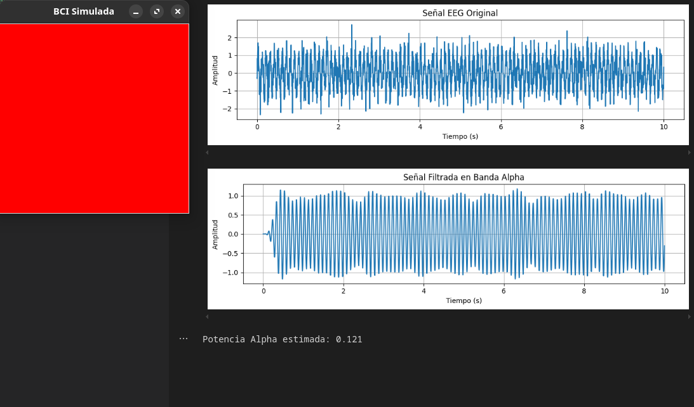

# 🧪 1. Texturizado Dinámico y Shaders de Partículas

## 📅 Fecha
`2025-05-24`

## 🌷 Equipo de trabajo
Mi grupo está conformado por:

- Julián Ramírez Díaz (julramirezdi@unal.edu.co)
- Xamir Ernesto Rojas Gamboa (xerojasga@unal.edu.co)
- Julián David Rincón Orjuela (jurinconor@unal.edu.co)
- María Fernanda Cala Rodríguez (mcalar@unal.edu.co)

Este taller fue realizado por:

**Julián David Rincón Orjuela (jurinconor@unal.edu.co)**


## 🎯 Objetivo del Taller

Implementar una simulación de un sistema de interfaz cerebro-computadora (BCI) utilizando datos EEG simulados. El objetivo es procesar señales EEG, calcular la potencia en la banda Alpha, y proporcionar retroalimentación visual en tiempo real basada en un umbral configurable.

---

## 🧠 Conceptos Aprendidos

- Procesamiento de señales EEG con Python.
- Uso de filtros pasa banda para extraer frecuencias específicas.
- Cálculo de potencia espectral en bandas de frecuencia (Alpha).
- Visualización interactiva con `matplotlib` y `tkinter`.

---

## 🔧 Herramientas y Entornos

- Python 3
- Bibliotecas: `numpy`, `pandas`, `matplotlib`, `scipy`, `tkinter`
- Archivo CSV con datos EEG simulados

---

## 🧪 Implementación

### 🔹 Etapas realizadas
1. Configuración del entorno y carga de datos EEG simulados.
2. Aplicación de un filtro pasa banda para extraer la banda Alpha (8-12 Hz).
3. Cálculo de la potencia espectral en la banda Alpha.
4. Visualización de la señal EEG y retroalimentación visual basada en el umbral.

### 🔹 Código relevante

- **Filtro Pasa Banda**: Extrae frecuencias específicas de la señal EEG.

```python
def apply_bandpass(data, lowcut, highcut, fs):
    b, a = butter_bandpass(lowcut, highcut, fs)
    return lfilter(b, a, data)
```
- **Cálculo de Potencia Alpha:** Calcula la potencia espectral en la banda Alpha.


```python
def compute_alpha_power(signal, fs):
    f, pxx = welch(signal, fs=fs, nperseg=1024)
    alpha_mask = (f >= ALPHA_BAND[0]) & (f <= ALPHA_BAND[1])
    alpha_power = np.mean(pxx[alpha_mask])
    return alpha_power
```

- **Visualización de la Señal:** Muestra la señal EEG en gráficos.


```python
def plot_signal(time, signal, title="EEG Signal"):
    plt.figure(figsize=(10, 3))
    plt.plot(time, signal, label="EEG")
    plt.xlabel("Tiempo (s)")
    plt.ylabel("Amplitud")
    plt.title(title)
    plt.grid()
    plt.tight_layout()
    plt.show()
``` 


- **Retroalimentación Visual:** Cambia el color de la ventana según la potencia Alpha.

```python
def visual_feedback(alpha_power, threshold):
    color = "green" if alpha_power > threshold else "red"
    root = tk.Tk()
    root.title("BCI Simulada")
    root.geometry("300x300")
    canvas = tk.Canvas(root, width=300, height=300, bg=color)
    canvas.pack()
    label = tk.Label(root, text=f"Alpha Power: {alpha_power:.3f}", font=("Arial", 14))
    label.pack(pady=10)
    root.mainloop()
``` 

### Resultados Visuales

Señal EEG Original: Visualización de la señal EEG simulada.
Señal Filtrada en Banda Alpha: Visualización de la señal filtrada en la banda Alpha.
Retroalimentación Visual: Ventana que cambia de color (verde o rojo) según la potencia Alpha calculada.

## Resultados Datos Sinteticos

- alpha_power > threshold


- alpha_power < threshold



---

### Reflexion Final

Este taller permitió explorar el procesamiento de señales EEG simuladas y su visualización interactiva. La implementación de un filtro pasa banda y el cálculo de potencia Alpha demuestran cómo se pueden extraer características relevantes de señales cerebrales. Además, la retroalimentación visual en tiempo real ilustra cómo los sistemas BCI pueden integrarse en aplicaciones prácticas

