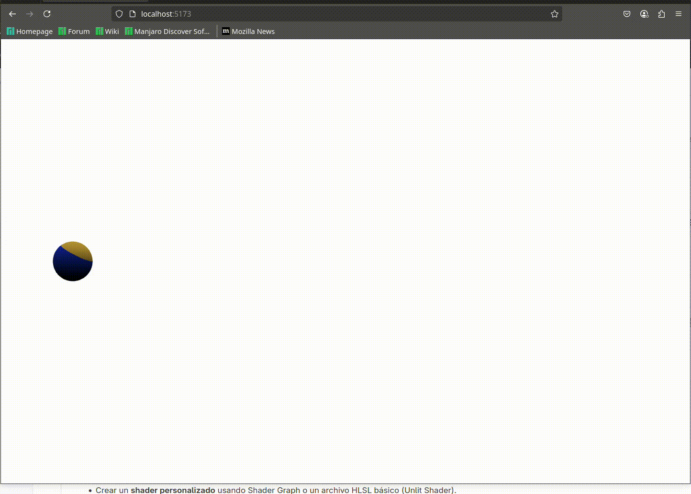

# 🧪 0. Transformaciones Básicas

## 📅 Fecha
`2025-05-24` 

## 🌷 Equipo de trabajo
Mi grupo está conformado por:

- Julián Ramírez Díaz (julramirezdi@unal.edu.co)
- Xamir Ernesto Rojas Gamboa (xerojasga@unal.edu.co)
- Julián David Rincón Orjuela (jurinconor@unal.edu.co)
- María Fernanda Cala Rodríguez (mcalar@unal.edu.co)

Este taller fue realizado por:

**Julián David Rincón Orjuela (jurinconor@unal.edu.co)**

## 🎯 Objetivo del Taller

Introducir la creación de shaders personalizados para modificar visualmente materiales en tiempo real, comprendiendo la estructura básica de un shader y aplicando efectos visuales mediante código.

---

## 🧠 Conceptos Aprendidos

- Uso de shaders personalizados en Three.js.
- Diferencia entre vertex shaders y fragment shaders.
- Aplicación de efectos visuales como toon shading y gradientes.
- Animación de materiales mediante uniformes (como `uTime`).
---

## 🔧 Herramientas y Entornos


- Three.js / React Three Fiber
- GLSL para shaders
- JavaScript / React

---

## 🧪 Implementación

### 🔹 Etapas realizadas
1. Preparación de datos y entorno.
2. Implementación de los algortimos
3. Visualización o interacción.
4. Guardado de resultados.

### 🔹 Código relevante


- **Vertex Shader**: Define las posiciones y normales de los vértices para su uso en el fragment shader.

```glsl
varying vec3 vPosition;
varying vec3 vNormal;

void main() {
  vPosition = position;
  vNormal = normal;
  gl_Position = projectionMatrix * modelViewMatrix * vec4(position, 1.0);
}
```
- **Animación de la Esfera**: Actualiza el tiempo uniforme (uTime) para animar los efectos visuales.
```javascript
useFrame(({ clock }) => {
  ref.current.uTime = clock.getElapsedTime();
});
```


---

## 📊 Resultados Visuales

- Toon Shading: Colores planos basados en la intensidad de la luz.
- Gradiente: Transición de colores basada en la posición vertical de la esfera.
- Animación Pulsante: Variación de la intensidad del color en función del tiempo.

### Three.js




## 💬 Reflexión Final

Este taller permitió explorar la creación de shaders personalizados y su integración en Three.js. La implementación de efectos visuales como toon shading y gradientes, junto con la animación mediante uniformes, demuestra el potencial creativo de los shaders para enriquecer experiencias visuales en aplicaciones 3D.
