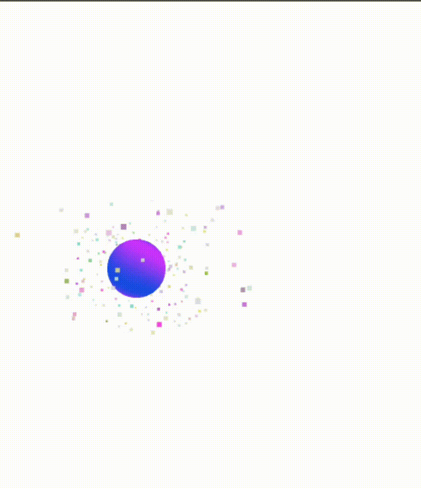

# 🧪 1. Texturizado Dinámico y Shaders de Partículas

## 📅 Fecha
`2025-05-24`

## 🌷 Equipo de trabajo
Mi grupo está conformado por:

- Julián Ramírez Díaz (julramirezdi@unal.edu.co)
- Xamir Ernesto Rojas Gamboa (xerojasga@unal.edu.co)
- Julián David Rincón Orjuela (jurinconor@unal.edu.co)
- María Fernanda Cala Rodríguez (mcalar@unal.edu.co)

Este taller fue realizado por:

**Julián David Rincón Orjuela (jurinconor@unal.edu.co)**

## 🎯 Objetivo del Taller

Explorar la creación de shaders personalizados para texturizado dinámico y sistemas de partículas, integrando interactividad y animaciones en tiempo real mediante Three.js y React Three Fiber.

---

## 🧠 Conceptos Aprendidos

- Creación de shaders personalizados con GLSL.
- Uso de uniformes para animaciones basadas en tiempo (`uTime`) y posición del mouse (`uMouse`).
- Implementación de efectos visuales como texturas dinámicas y partículas animadas.
- Integración de geometrías y materiales personalizados en Three.js.

---

## 🔧 Herramientas y Entornos

- Three.js / React Three Fiber
- GLSL para shaders
- JavaScript / React

---

## 🧪 Implementación

### 🔹 Etapas realizadas
1. Configuración del entorno y preparación de datos.
2. Implementación de shaders para texturizado dinámico.
3. Creación de un sistema de partículas animadas.
4. Visualización interactiva y ajustes finales.

### 🔹 Código relevante

- **Vertex Shader**: Define las coordenadas UV para el texturizado dinámico.

```glsl
varying vec2 vUv;
void main() {
  vUv = uv;
  vec3 pos = position;
  gl_Position = projectionMatrix * modelViewMatrix * vec4(pos, 1.0);
}
```
- **Fragment Shader**: Genera un efecto de energía líquida reactiva al mouse.

```glsl
uniform float uTime;
uniform vec2 uMouse;
varying vec2 vUv;

void main() {
  vec2 center = vUv - 0.5;
  float dist = length(center - uMouse);
  float glow = sin(uTime * 3.0 + dist * 10.0) * 0.5 + 0.5;
  vec3 color = mix(vec3(0.1, 0.3, 0.9), vec3(0.8, 0.2, 1.0), glow);
  float pulse = 1.0 - smoothstep(0.0, 0.3, dist);
  gl_FragColor = vec4(color + pulse * 0.3, 1.0);
}
```

- **Sistema de Partículas**: Anima partículas alrededor de un objeto central.

```javascript
useFrame(({ clock }) => {
  const t = clock.getElapsedTime()
  const positions = meshRef.current.geometry.attributes.position.array
  for (let i = 0; i < count; i++) {
    const i3 = i * 3
    positions[i3 + 1] += Math.sin(t + i) * 0.001
  }
  meshRef.current.geometry.attributes.position.needsUpdate = true
})
```
- **Esfera Líquida**: Crea una esfera animada con texturizado dinámico.

```javascript
<mesh>
  <sphereGeometry args={[1.2, 64, 64]} />
  <liquidMaterial ref={matRef} />
</mesh>
```

### Resultados Visuales

Texturizado Dinámico: Efecto de energía líquida reactiva al movimiento del mouse.
Sistema de Partículas: Partículas vibrantes que rodean la esfera animada.
Interactividad: Animaciones en tiempo real basadas en la posición del mouse.




### Reflexion Final

Este taller permitió explorar la creación de shaders personalizados y su integración en Three.js. La implementación de texturizado dinámico y sistemas de partículas demuestra cómo los shaders pueden enriquecer la interactividad y las experiencias visuales en aplicaciones 3D.

