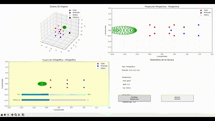

# 🧪 Taller - Proyecciones 3D: Cómo ve una Cámara Virtual

## 📅 Fecha
2025-05-23

## 🌷 Equipo de trabajo
Mi grupo está conformado por:

- Julián Ramírez Díaz (julramirezdi@unal.edu.co)
- Xamir Ernesto Rojas Gamboa (xerojasga@unal.edu.co)
- Julián David Rincón Orjuela (jurinconor@unal.edu.co)
- María Fernanda Cala Rodríguez (mcalar@unal.edu.co)

Este taller fue realizado por:

**María Fernanda Cala Rodríguez (mcalar@unal.edu.co)**

## 🎯 Objetivo del Taller
Este taller tiene como objetivo comprender y aplicar los conceptos fundamentales de geometría proyectiva y el uso de matrices de proyección para representar escenas tridimensionales en un plano bidimensional. A través de Python, matplotlib y numpy, desarrollamos un visualizador interactivo que permite experimentar en tiempo real los efectos de estos sistemas de proyección (perspectiva y ortográfica), entendiendo el papel fundamental que juegan las matrices de transformación en el pipeline gráfico moderno.

## 🧠 Conceptos Aprendidos
✅ Diferencias entre proyección en perspectiva y ortográfica  
✅ Implementación de matrices de proyección 4x4  
✅ Pipeline de transformación de coordenadas 3D a 2D  
✅ Cálculo de matrices de vista (view matrix)  
✅ Transformación de coordenadas de mundo a coordenadas de cámara  
✅ División de perspectiva y normalización homogénea  
✅ Manipulación interactiva de parámetros de cámara (FOV, distancia)  
✅ Visualización simultánea de ambas proyecciones para comparación  
✅ Simulación de frustum de cámara virtual  
✅ Coordenadas homogéneas y su importancia en gráficos 3D  

## 🔧 Herramientas y Entornos
- **Python 3.8+**
- **NumPy** - Cálculos matriciales y operaciones vectoriales
- **Matplotlib** - Visualización 2D y 3D
- **Matplotlib.widgets** - Interfaz interactiva con sliders y botones

## 📁 Estructura del Proyecto
```
2025-05-23_taller_proyecciones_camara_virtual/
├── proyecciones_3d.py          # Código principal del visualizador
├── README.md                   # Este archivo
└── capturas/                   # Screenshots y GIFs de demostración
    ├── vista_general.gif
    ├── comparacion_proyecciones.gif
    └── animacion_camara.gif
```

## 📐 Proyección en Perspectiva vs. Ortográfica

### 🔹 Proyección en Perspectiva
La proyección en perspectiva simula la forma en que percibimos el mundo real, donde los objetos parecen más pequeños a medida que se alejan del observador. Este tipo de proyección crea una sensación de profundidad y es el estándar para la mayoría de aplicaciones 3D interactivas.

**Parámetros clave:**
- **FOV (Field of View)**: Ángulo de visión, típicamente entre 30-120 grados
- **Aspect Ratio**: Relación entre el ancho y alto del viewport
- **Near Plane**: Distancia mínima desde la cámara donde comienza la renderización
- **Far Plane**: Distancia máxima desde la cámara donde termina la renderización

La matriz de proyección en perspectiva transforma el frustum (forma de pirámide truncada) en un cubo unitario para la rasterización.

**Matriz de Proyección Perspectiva:**
```
[f/aspect    0      0                    0               ]
[0           f      0                    0               ]
[0           0   (far+near)/(near-far)  2*far*near/(near-far)]
[0           0     -1                    0               ]
```

### 🔹 Proyección Ortográfica
La proyección ortográfica no tiene en cuenta la profundidad para escalar los objetos. Los objetos mantienen su tamaño independientemente de la distancia a la cámara, creando una vista sin perspectiva que es útil para diseño técnico, diagramas y vistas arquitectónicas.

**Parámetros clave:**
- **Left/Right**: Límites horizontales del volumen de visualización
- **Top/Bottom**: Límites verticales del volumen de visualización  
- **Near/Far**: Límites de profundidad del volumen de visualización

**Matriz de Proyección Ortográfica:**
```
[2/(r-l)     0        0       -(r+l)/(r-l)]
[0        2/(t-b)     0       -(t+b)/(t-b)]
[0           0    -2/(f-n)    -(f+n)/(f-n)]
[0           0        0             1     ]
```

## 🎬 Demostraciones Visuales



## 🔹 Código Relevante

Este fragmento muestra la implementación del núcleo del sistema de proyección:

```python
def proyectar_puntos(self, puntos, tipo_proyeccion='perspectiva'):
    """
    Proyecta puntos 3D a coordenadas 2D usando la matriz especificada
    
    Args:
        puntos: array de puntos 3D (3xN)
        tipo_proyeccion: 'perspectiva' o 'ortografica'
    
    Returns:
        puntos_2d: coordenadas 2D proyectadas
    """
    # Convertir a coordenadas homogéneas (añadir componente W=1)
    puntos_hom = np.vstack([puntos, np.ones(puntos.shape[1])])
    
    # Paso 1: Aplicar matriz de vista (mundo -> espacio cámara)
    vista = self.matriz_vista()
    puntos_vista = vista @ puntos_hom
    
    # Paso 2: Aplicar matriz de proyección (cámara -> espacio clip)
    if tipo_proyeccion == 'perspectiva':
        proj_matrix = self.matriz_proyeccion_perspectiva()
    else:
        proj_matrix = self.matriz_proyeccion_ortografica()
    
    puntos_proj = proj_matrix @ puntos_vista
    
    # Paso 3: División de perspectiva (normalización homogénea)
    if tipo_proyeccion == 'perspectiva':
        # Dividir X, Y, Z por W para lograr el efecto de perspectiva
        w = puntos_proj[3, :]
        w[w == 0] = 1e-10  # Evitar división por cero
        puntos_proj = puntos_proj / w
    
    # Retornar solo coordenadas X, Y (proyección 2D)
    return puntos_proj[:2, :]
```

La implementación de la matriz de proyección perspectiva:

```python
def matriz_proyeccion_perspectiva(self):
    """
    Calcula la matriz de proyección perspectiva basada en FOV
    """
    fov_rad = np.radians(self.fov)
    f = 1.0 / np.tan(fov_rad / 2.0)  # Factor de escala basado en FOV
    
    return np.array([
        [f / self.aspect_ratio, 0, 0, 0],
        [0, f, 0, 0],
        [0, 0, (self.far + self.near) / (self.near - self.far), 
         (2 * self.far * self.near) / (self.near - self.far)],
        [0, 0, -1, 0]  # Esta fila convierte Z en -W para la división perspectiva
    ])
```

## 🧩 Prompts Usados

### Prompt 1: Claude Sonnet 4
```
Crea una aplicación Python completa usando matplotlib y numpy para visualizar y comparar proyecciones de cámara virtual perspectiva y ortográfica. La aplicación debe:

1. Implementar una clase CamaraVirtual con:
   - Matrices de vista y proyección (perspectiva y ortográfica)
   - Parámetros configurables (FOV, distancia, límites ortográficos)
   - Método para proyectar puntos 3D a 2D

2. Crear una escena 3D con múltiples objetos a diferentes distancias:
   - Un cubo en el origen
   - Una pirámide más alejada  
   - Una esfera más cercana

3. Implementar un visualizador con 4 paneles:
   - Vista 3D de la escena original
   - Proyección perspectiva 2D
   - Proyección ortográfica 2D
   - Panel de parámetros de cámara

4. Incluir controles interactivos:
   - Sliders para FOV y distancia de cámara
   - Botón para alternar tipo de proyección
   - Botón para animación orbital de la cámara

5. Código bien comentado explicando cada transformación matemática
6. Función de demostración que muestre las matrices calculadas
```

### Prompt 2: Claude Sonnet 4
```
Crea un README.md completo para un taller de "Proyecciones 3D: Cómo ve una Cámara Virtual" en Python. El README debe incluir:

1. Estructura del documento similar al ejemplo proporcionado con:
   - Título con emoji, fecha y equipo
   - Objetivo del taller claramente definido
   - Lista de conceptos aprendidos con checkmarks
   - Herramientas utilizadas (Python, NumPy, Matplotlib)

2. Sección técnica detallada sobre:
   - Diferencias entre proyección perspectiva y ortográfica
   - Matrices matemáticas con formato de código
   - Parámetros clave de cada tipo de proyección

3. Estructura del proyecto con árbol de directorios

4. Secciones para demostraciones visuales:
   - Vista general del visualizador
   - Comparación entre proyecciones
   - Animación de cámara orbital

5. Fragmentos de código relevantes con explicaciones detalladas

6. Lista de prompts utilizados para generar el código

7. Reflexión final sobre el pipeline de transformación 3D a 2D

Usa emojis apropiados y formato markdown profesional.
```

### Prompt 3: Claude Sonnet 4
```
Optimiza el sistema de cálculo de matrices de proyección en Python para que:

1. Implemente correctamente las transformaciones matemáticas del pipeline gráfico:
   - Transformación de modelo a mundo
   - Transformación de mundo a vista (view matrix)
   - Transformación de vista a clip space (projection matrix)
   - División de perspectiva y normalización

2. Maneje correctamente las coordenadas homogéneas

3. Evite divisiones por cero y casos edge

4. Incluya validación de parámetros de entrada

5. Optimice el rendimiento para renderizado en tiempo real

6. Proporcione debugging detallado mostrando matrices intermedias

7. Documente cada paso matemático con comentarios explicativos
```

### Prerrequisitos
```bash
pip install numpy matplotlib
```

### Ejecución
```bash
python proyecciones_3d.py
```

### Controles Interactivos
- **Slider FOV**: Ajusta el campo de visión de la proyección perspectiva (30°-120°)
- **Slider Distancia**: Modifica la distancia de la cámara al origen (1-10 unidades)
- **Botón "Cambiar Proyección"**: Alterna entre vista perspectiva y ortográfica activa
- **Botón "Animar Cámara"**: Ejecuta una rotación orbital automática de 360°

### Interpretación de Resultados
- **Panel superior izquierdo**: Vista 3D de la escena original con posición de cámara
- **Panel superior derecho**: Proyección perspectiva (objetos lejanos más pequeños)
- **Panel inferior izquierdo**: Proyección ortográfica (tamaño constante independiente de distancia)
- **Panel inferior derecho**: Parámetros actuales de la cámara

### Pipeline de Transformación Completo
El proceso completo de renderizado sigue estos pasos matemáticos:

1. **Coordenadas de Modelo** → **Coordenadas de Mundo**
   ```
   P_mundo = M_modelo * P_local
   ```

2. **Coordenadas de Mundo** → **Coordenadas de Vista**
   ```
   P_vista = M_vista * P_mundo
   ```

3. **Coordenadas de Vista** → **Coordenadas de Clip**
   ```
   P_clip = M_proyección * P_vista
   ```

4. **División de Perspectiva** (solo para proyección perspectiva)
   ```
   P_ndc = P_clip / P_clip.w
   ```

5. **Coordenadas NDC** → **Coordenadas de Pantalla**
   ```
   P_pantalla = viewport_transform(P_ndc)
   ```

### Cálculo de la Matriz de Vista

La matriz de vista se construye usando el sistema de coordenadas de la cámara:

```python
# Vectores del sistema de coordenadas de la cámara
forward = normalize(target - posicion)  # Dirección hacia donde mira
right = normalize(cross(forward, up))   # Vector derecha
up_cam = cross(right, forward)          # Vector arriba recalculado

# Matriz de vista = Rotación * Traslación
M_vista = [
    [right.x,   right.y,   right.z,   -dot(right, posicion)],
    [up_cam.x,  up_cam.y,  up_cam.z,  -dot(up_cam, posicion)],
    [-forward.x, -forward.y, -forward.z, dot(forward, posicion)],
    [0,         0,         0,         1]
]
```
### Reflexión Personal

Este taller me ha permitido no solo implementar estos conceptos desde cero, sino también **visualizar interactivamente** cómo pequeños cambios en los parámetros de una cámara virtual pueden transformar completamente la percepción de una escena 3D. 

La capacidad de alternar en tiempo real entre proyección perspectiva y ortográfica ha sido particularmente reveladora, mostrando de manera tangible conceptos que antes solo conocía teóricamente. Ver cómo la misma escena 3D puede representarse de maneras tan diferentes dependiendo de una simple matriz de transformación, ilustra la potencia y elegancia de las matemáticas en gráficos por computadora.

