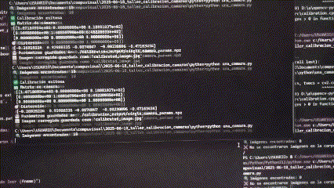
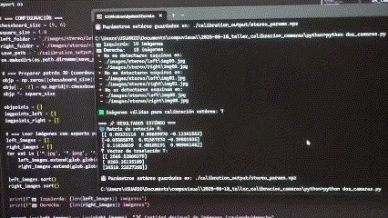

# 🧪 Taller - Calibración de Cámaras con OpenCV

## 📅 Fecha

2025-05-17

## 🌷 Equipo de trabajo

**Mi grupo está conformado por:**

- Julián Ramírez Díaz (julramirezdi@unal.edu.co)  
- Julián David Rincón Orjuela (jurinconor@unal.edu.co)  
- María Fernanda Cala Rodríguez (mcalar@unal.edu.co)

**Este taller fue realizado por:**
- María Fernanda Cala Rodríguez (mcalar@unal.edu.co)

## 🎯 Objetivo del Taller

El objetivo de este taller es realizar la calibración de una y dos cámaras utilizando **OpenCV**, con el fin de obtener sus parámetros intrínsecos y extrínsecos, coeficientes de distorsión y matrices de rectificación. Esto es esencial en aplicaciones de reconstrucción 3D, visión estéreo, realidad aumentada y sistemas de navegación autónomos.

## 🧠 Conceptos Aprendidos

✅ Calibración de cámara individual con patrón de ajedrez  
✅ Detección precisa de esquinas internas con cornerSubPix  
✅ Obtención de la matriz intrínseca y distorsión radial/tangencial  
✅ Validación de la calibración mediante corrección de distorsión  
✅ Calibración estéreo para obtener rotación y traslación entre cámaras  
✅ Rectificación de imágenes estéreo  
✅ Uso de `stereoCalibrate` y `stereoRectify` en OpenCV  
✅ Almacenamiento de parámetros para uso futuro en reconstrucción

## 🔧 Herramientas y Entornos

- Python 3.x  
- OpenCV (`cv2`)  
- Imágenes de patrón de ajedrez (tomadas o de muestra)  
- NumPy  
- Jupyter o scripts `.py` ejecutables

## 📁 Estructura del Proyecto

2025-06-18_taller_calibracion_camaras
├── python/
│   ├── una\_camara/
│   ├── dos\_camaras/
│   ├── imagenes/
│   └── README.md

## 🔹 Fragmentos de Código Relevantes

### 📸 Parte 1 – Calibración de una sola cámara
```
# Definición de objeto 3D y detección de esquinas
objp = np.zeros((9*6, 3), np.float32)
objp[:, :2] = np.mgrid[0:9, 0:6].T.reshape(-1, 2)

# Detección y refinamiento
ret, corners = cv2.findChessboardCorners(gray, (9, 6), None)
if ret:
    corners2 = cv2.cornerSubPix(gray, corners, (11,11), (-1,-1), criteria)
    imgpoints.append(corners2)

# Calibración
ret, mtx, dist, rvecs, tvecs = cv2.calibrateCamera(objpoints, imgpoints, gray.shape[::-1], None, None)

# Corrección de distorsión
newcameramtx, roi = cv2.getOptimalNewCameraMatrix(mtx, dist, (w,h), 1, (w,h))
dst = cv2.undistort(img, mtx, dist, None, newcameramtx)

```
----------

### 🎥 Parte 2 – Calibración estéreo

```
# Calibrar cámaras izquierda y derecha
retL, mtxL, distL, _, _ = cv2.calibrateCamera(objpoints, imgpoints_left, grayL.shape[::-1], None, None)
retR, mtxR, distR, _, _ = cv2.calibrateCamera(objpoints, imgpoints_right, grayR.shape[::-1], None, None)

# Calibración estéreo
retS, _, _, _, _, R, T, E, F = cv2.stereoCalibrate(
    objpoints, imgpoints_left, imgpoints_right,
    mtxL, distL, mtxR, distR, grayL.shape[::-1],
    criteria=criteria, flags=cv2.CALIB_FIX_INTRINSIC
)

# Rectificación estéreo
R1, R2, P1, P2, Q, _, _ = cv2.stereoRectify(mtxL, distL, mtxR, distR, grayL.shape[::-1], R, T)
```

----------

## 💻 Vista Previa

Una sola cámara.




Estéreo.



## ✨ Prompts Usados

### 🎯 Prompt 1: Script para calibrar una sola cámara


Claude Sonnet 4:

`Crea un script en Python usando OpenCV que tome múltiples imágenes de un tablero de ajedrez para calibrar una cámara. El script debe detectar esquinas, calcular la matriz de la cámara y los coeficientes de distorsión, y guardar una imagen corregida como validación.` 

----------

### 🎯 Prompt 2: Script para calibración estéreo de dos cámaras

Claude Sonnet 4:

`Crea un script en Python con OpenCV que realice calibración estéreo entre dos cámaras usando imágenes del mismo patrón de ajedrez tomadas desde ambas vistas. El script debe calcular la matriz de rotación, vector de traslación, y realizar rectificación estéreo con stereoRectify.` 

----------

### 🎯 Prompt 3: Estructura del proyecto y README tipo taller

GPT4o:

`Crea un README.md con estilo de taller académico para un proyecto de calibración de cámaras. Debe incluir: - Título, fecha y autores  - Objetivos del taller  - Lista de conceptos aprendidos  - Herramientas usadas  - Pasos explicativos de la calibración de una y dos cámaras  - Fragmentos de código relevantes  - Estructura de carpetas  - Reflexión final sobre la importancia de calibrar cámaras en visión por computador  - Prompts usados`

## 💬 Reflexión Final

La calibración de cámaras es un paso fundamental en visión por computador. Permite corregir distorsiones ópticas y entender la geometría del sistema de captura. Al obtener las matrices de calibración, podemos transformar puntos del mundo real a coordenadas de imagen, y en estéreo, incluso reconstruir la profundidad.

Estos conceptos son la base de aplicaciones avanzadas como:

-   Reconstrucción 3D
    
-   Mapas de disparidad
    
-   SLAM
    
-   Realidad aumentada
    

A través de este taller, entendimos cómo OpenCV abstrae el proceso matemático detrás de estas transformaciones y nos permite trabajar directamente con modelos de cámara y sus parámetros.
