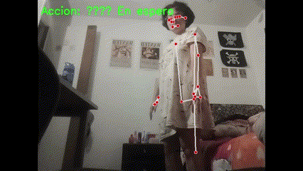

# 🕺 Taller - Reconocimiento de Acciones Corporales con MediaPipe

## 📅 Fecha

2025-06-20


##  🌷 Equipo de trabajo

  

**Mi grupo está conformado por:**

  

- Julián Ramírez Díaz (julramirezdi@unal.edu.co)

- Julián David Rincón Orjuela (jurinconor@unal.edu.co)

- María Fernanda Cala Rodríguez (mcalar@unal.edu.co)

  

**Este taller fue realizado por:**

  

- María Fernanda Cala Rodríguez (mcalar@unal.edu.co)
---

## 🎯 Objetivo del Taller

Implementar el reconocimiento de acciones simples (como sentarse, levantar brazos o caminar frente a cámara) usando MediaPipe Pose para detectar la postura corporal. El objetivo es utilizar puntos clave del cuerpo (landmarks) para interpretar la acción y responder visualmente o con sonidos.

---

## 🧠 Conceptos Aprendidos

✅ Captura de video en tiempo real con OpenCV  
✅ Detección de postura corporal con MediaPipe Pose  
✅ Extracción y análisis de landmarks corporales  
✅ Lógica para interpretación de acciones humanas  
✅ Visualización de acciones con overlays y texto  
✅ Detección de caminata mediante movimiento alternado  
✅ Evaluación de precisión y errores en tiempo real

---

## 🔧 Herramientas Utilizadas

- Python 3.x
- OpenCV (`opencv-python`)
- MediaPipe (`mediapipe`)
- NumPy
- (Opcional) Pygame para efectos sonoros
- (Opcional) Tkinter o GUI con `cv2.putText`

---

## 🧪 Acciones Reconocidas

| Acción              | Criterio lógico basado en landmarks             |
|---------------------|-------------------------------------------------|
| 🙌 Brazos levantados | Ambas muñecas por encima de la nariz           |
| 🪑 Persona sentada   | Caderas por debajo de las rodillas             |
| 🚶 Caminando         | Alternancia en la posición vertical de los pies|

---

## 📷 Demo (GIF)



---

## 📁 Estructura del Proyecto

acciones_pose/
├── taller37.py
├── README.md

---


## 🔍 Fragmento de código relevante

`if left_wrist_y < nose_y and right_wrist_y < nose_y:
    action = "🙌 Brazos levantados"  elif left_hip_y > left_knee_y and right_hip_y > right_knee_y:
    action = "🪑 Persona sentada"  else: if  abs(left_foot_y - prev_left_foot_y) > 0.02  or  abs(right_foot_y - prev_right_foot_y) > 0.02:
        walking_counter += 1  if walking_counter > walk_threshold:
        action = "🚶 Caminando"`
        
## 🤖 Prompt Usado
```
Crear un script de Python que use MediaPipe Pose para detectar acciones humanas básicas (sentado, brazos arriba, caminando). El script debe capturar video en tiempo real con OpenCV, procesar los landmarks del cuerpo y mostrar la acción detectada en pantalla.
```

## 💬 Reflexión Final

Durante la implementación del reconocimiento de acciones, la acción más sencilla de detectar fue "brazos arriba", ya que las muñecas tienen un movimiento muy notorio respecto a la cabeza.

En contraste, la detección de "caminata" fue más desafiante debido a su variabilidad: las posiciones de los pies cambian sutilmente y requieren umbrales bien ajustados para evitar falsos positivos.

También se observó que la acción de "sentarse" puede generar falsos positivos si el usuario se inclina o baja el torso sin flexionar completamente las piernas. Esto destaca la necesidad de afinar más los criterios lógicos y considerar más puntos del cuerpo (como los tobillos o el ángulo de las piernas) para una clasificación robusta.

Este ejercicio me ayudó a comprender no solo el funcionamiento interno de MediaPipe, sino también la complejidad de traducir posturas humanas a reglas lógicas interpretables por código.

