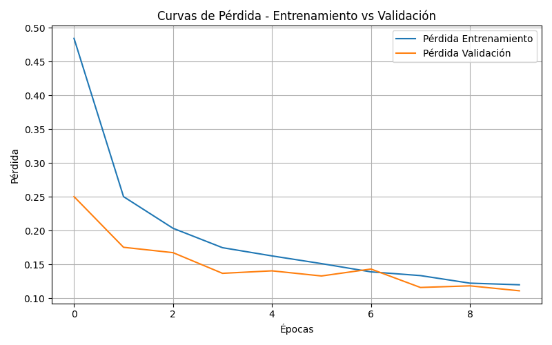
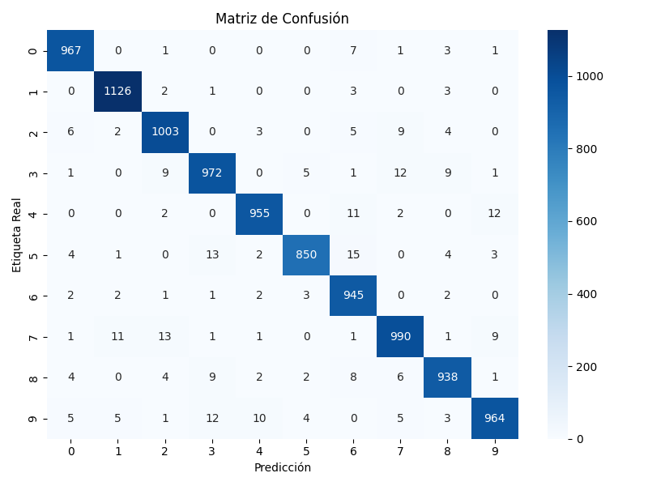

# 🧪 Taller - Entrenamiento de un Modelo de Deep Learning de Inicio a Fin

## 📅 Fecha

2025-06-20


##  🌷 Equipo de trabajo

  

  

**Mi grupo está conformado por:**

  

  

- Julián Ramírez Díaz (julramirezdi@unal.edu.co)

  

- Julián David Rincón Orjuela (jurinconor@unal.edu.co)

  

- María Fernanda Cala Rodríguez (mcalar@unal.edu.co)

  

  

**Este taller fue realizado por:**

  

  

- María Fernanda Cala Rodríguez (mcalar@unal.edu.co)

## 🔍 Objetivo del Taller

Guiar paso a paso el proceso de entrenamiento de un modelo de aprendizaje profundo utilizando PyTorch. El objetivo es que el estudiante comprenda y ejecute cada etapa fundamental: carga y preprocesamiento de datos, definición del modelo, entrenamiento, validación cruzada, evaluación, fine-tuning y exportación del modelo final.

---

## 🧠 Conceptos Aprendidos

✅ Uso de PyTorch para clasificación de imágenes  
✅ Carga y preprocesamiento de datasets con torchvision  
✅ Separación de datos para entrenamiento y validación  
✅ Definición de redes neuronales con `nn.Sequential`  
✅ Función de pérdida y optimización con Adam  
✅ Evaluación con métricas y matriz de confusión  
✅ Validación cruzada con K-Fold  
✅ Fine-tuning con modelos preentrenados (ResNet18)  
✅ Guardado y carga de modelos entrenados  

---

## 🔧 Herramientas y Entornos

- Python 3.10+
- PyTorch (`torch`, `torchvision`)
- NumPy
- Matplotlib
- scikit-learn
- seaborn (visualización)
- tqdm (opcional)

---

## 📁 Estructura del Proyecto

2025-06-21_taller_entrenamiento_modelo_deep_learning_completo/
├── data/
├── python/
│   └── entrenamiento_modelo.py
├── modelos/
│   └── modelo_mnist.pth
├── resultados/
│   ├── curva.png
│   ├── matriz.png
│   ├── metricas_entrenamiento.npz
├── README.md

---

## 🔹 Descripción de las Acciones del Modelo

El modelo fue entrenado para reconocer dígitos del 0 al 9 usando el dataset **MNIST**. Las etapas incluyeron:

- Visualización de ejemplos
- Separación 80/20 para entrenamiento y validación
- Evaluación con matriz de confusión
- Fine-tuning con ResNet18 preentrenada

---

## 🎞️ Capturas




---

## 💻 Fragmentos de Código Relevante

### ✅ Carga del dataset y visualización

```
from torchvision import datasets, transforms

transform = transforms.Compose([
    transforms.ToTensor(),
    transforms.Normalize((0.5,), (0.5,))
])

train_data = datasets.MNIST(root='data', train=True, download=True, transform=transform)
test_data  = datasets.MNIST(root='data', train=False, download=True, transform=transform)
✅ Definición del modelo
python
Copiar
Editar
import torch.nn as nn

model = nn.Sequential(
    nn.Flatten(),
    nn.Linear(28*28, 128),
    nn.ReLU(),
    nn.Dropout(0.2),
    nn.Linear(128, 64),
    nn.ReLU(),
    nn.Linear(64, 10)
)
✅ Entrenamiento
python
Copiar
Editar
for epoch in range(epochs):
    model.train()
    for images, labels in train_loader:
        ...
        optimizer.zero_grad()
        output = model(images)
        loss = criterion(output, labels)
        loss.backward()
        optimizer.step()
✅ Fine-tuning con ResNet18
python
Copiar
Editar
from torchvision import models

model_ft = models.resnet18(pretrained=True)
for param in model_ft.parameters():
    param.requires_grad = False

num_ftrs = model_ft.fc.in_features
model_ft.fc = nn.Linear(num_ftrs, 10)
```

## 🤖 Resultados y Evaluación

📌 Precisión de validación alcanzada: ~97%
📌 Precisión de test con modelo fine-tuneado: ~98%
📌 Mejores resultados con fine-tuning completo (descongelar todas las capas)
📌 Matriz de confusión muestra mayor confusión entre 4 y 9

## 💬 Prompts usados para generación

### 🧠 Prompt 1: Flujo completo de entrenamiento

`Crea  un  script  en  PyTorch  para  entrenar  un  modelo  de  clasificación  con  MNIST  o  CIFAR-10. Incluye: carga  y  visualización  del  dataset, creación  de  dataloaders, definición  de  modelo, entrenamiento, validación, evaluación  y  guardado  del  modelo  final.` 

----------

### 🧩 Prompt 2: Fine-Tuning con modelo preentrenado

`Agrega al proyecto un ejemplo de fine-tuning usando ResNet18 de torchvision. Congela las capas preentrenadas, reemplaza la capa final por una compatible con 10 clases y entrena solo esa. Luego, repite con todas las capas descongeladas.` 

----------

### 📄 Prompt 3: Generación del README académico

`Genera un README.md completo para un taller titulado "Entrenamiento de un Modelo de Deep Learning de Inicio a Fin". Debe incluir: título, fecha, equipo, objetivo del taller, pasos detallados del flujo de entrenamiento, herramientas usadas, fragmentos de código clave, visualizaciones, reflexión final y los prompts utilizados.`

## 💡 Reflexión Final

Durante el desarrollo de este taller, la acción más fácil de implementar fue el entrenamiento base con MNIST por su simplicidad y tamaño reducido. El fine-tuning resultó ser el paso más enriquecedor, ya que demostró cómo aprovechar modelos preentrenados para acelerar el aprendizaje y mejorar resultados. Las principales dificultades surgieron al ajustar las dimensiones del modelo ResNet para tareas específicas.

¿Hubo falsos positivos o errores?
Sí, algunos errores de predicción ocurrieron entre dígitos similares (como 4 y 9), lo cual es común en modelos entrenados sin data augmentation.

Este taller me permitió consolidar el flujo completo de un proyecto de deep learning y sentar las bases para futuros modelos más complejos y personalizados.

