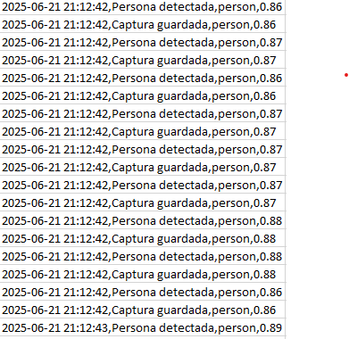
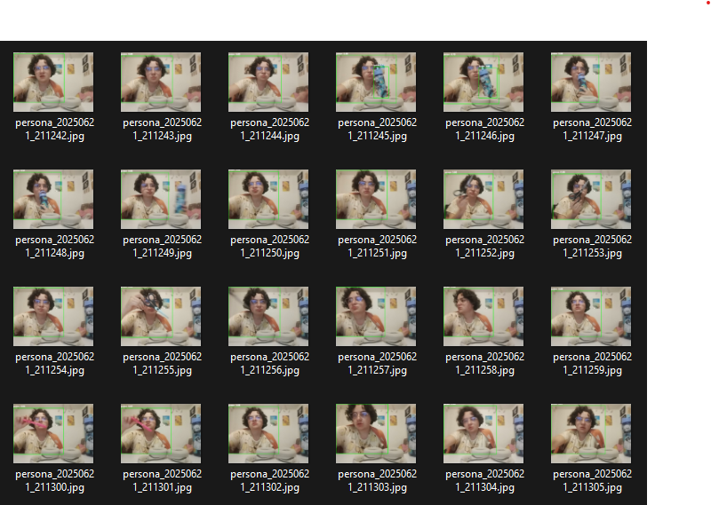

#  🎯 Taller - Detección de Objetos en Tiempo Real con Python y YOLO

  

##  📅 Fecha

**2025-06-21**

  

---

  


##  🌷 Equipo de trabajo

  

**Mi grupo está conformado por:**

  

- Julián Ramírez Díaz (julramirezdi@unal.edu.co)

- Julián David Rincón Orjuela (jurinconor@unal.edu.co)

- María Fernanda Cala Rodríguez (mcalar@unal.edu.co)

  

**Este taller fue realizado por:**

  

- María Fernanda Cala Rodríguez (mcalar@unal.edu.co)

  

---

  

##  🎯 Objetivo del Taller

  

Desarrollar un sistema en Python que capture video en tiempo real desde la cámara web, detecte personas u objetos utilizando modelos YOLOv5/v8, visualice estadísticas de detección y registre eventos automáticamente en archivos de log.

  

---

  

##  🧠 Conceptos Aplicados

  

- ✅ Uso de OpenCV para captura de video

- ✅ Detección de objetos con YOLOv8 (Ultralytics)

- ✅ Conteo en tiempo real de objetos detectados

- ✅ Visualización en vivo con Tkinter

- ✅ Registro automático de eventos en archivo CSV

- ✅ Captura de imágenes si se detecta una persona

- ✅ Organización de carpetas para logs y capturas

  

---

  

##  🛠️ Herramientas Necesarias

  

- Python 3.10+

- opencv-python

- ultralytics

- pandas

- PIL (Pillow)

- tkinter (incluido en Python)

- matplotlib (opcional para visualización posterior)

  


  

---

  

##  📁 Estructura del Proyecto

  


python/

├── capturas/ 

├── logs/ 

├── taller40.py 

├── README.md


  


  

##  🔧 Script Principal
  

El sistema realiza lo siguiente:

  

- Inicia captura desde webcam

- Detecta objetos con YOLOv8

- Muestra resultados en tiempo real con bounding boxes

- Si detecta una persona:

- Guarda una captura en `capturas/`

- Registra el evento en `logs/eventos.csv`

- Muestra interfaz en Tkinter con estado y conteo

  

###  🧩 Fragmento de código para detección

  

```

from ultralytics import YOLO

  

model = YOLO("yolov8n.pt") # Modelo pequeño por eficiencia

results = model(frame)[0]

  

for r in results.boxes:

clase = int(r.cls[0])

nombre = model.names[clase]

conf = float(r.conf[0])

...

if nombre == "person" and conf > 0.6:

```

  

##  📊 Demostraciones




  
## Prompts utilizados
GPT4o:
```
Crea un script en Python que:
- Capture video desde la webcam usando OpenCV
- Detecte personas y objetos en tiempo real usando YOLOv5, YOLOv8 o cvlib
- Cuente los objetos por clase y los muestre en un panel visual usando tkinter
- Registre eventos en un archivo CSV (timestamp, evento, clase, confianza)
- Guarde una captura si se detecta una persona
- Organice los archivos en carpetas: capturas/ y logs/
- Muestra el estado del sistema (inactivo o alerta)
```

GPT 4o:
```
Genera un README.md completo para un taller titulado "Detección de Objetos en Tiempo Real con Python y YOLO".
Debe incluir: título, fecha, equipo, objetivo del taller, conceptos aplicados, herramientas necesarias, estructura del proyecto, fragmentos de código clave, ejemplo de log generado, reflexión final y contacto.
```

  

##  💡 Reflexión Final

  

Este taller permitió implementar un sistema completo de visión por computador, combinando detección, interfaz gráfica y almacenamiento de eventos. El uso de YOLOv8 facilitó una detección robusta y rápida. El principal desafío fue manejar correctamente la frecuencia de captura y visualización para lograr una experiencia fluida y no duplicar registros.

  

Este proyecto puede escalar fácilmente para aplicaciones como vigilancia, conteo de personas, control de acceso o incluso notificaciones automáticas.

  