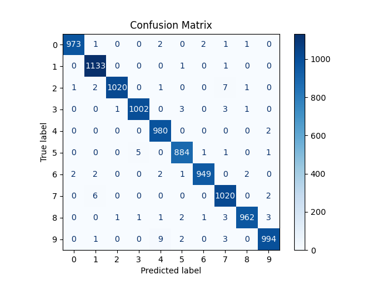

# 🧠 Red Neuronal Convolucional (CNN) para Clasificación de Imágenes

## 📅 Fecha
2025-06-23

---

## 🎯 Objetivo del Taller

Desarrollar una red neuronal convolucional (CNN) desde cero utilizando TensorFlow/Keras para clasificación de imágenes. El proyecto se enfoca en la comprensión práctica de las CNNs y su aplicación en visión por computador, utilizando el dataset MNIST como caso de estudio.

---

## 🧠 Conceptos Aprendidos

- Arquitectura de **Redes Neuronales Convolucionales**
- Procesamiento de **datasets de imágenes**
- Técnicas de **optimización y entrenamiento**
- **Evaluación de modelos** de deep learning
- **Visualización** de resultados y métricas
- Uso de **TensorFlow y Keras** para deep learning

---

## 🔧 Herramientas y Entornos

- Python 3.12
- TensorFlow 2.x
- NumPy
- Matplotlib
- Scikit-learn
- Jupyter Notebook

Instalación:
```bash
pip install tensorflow numpy matplotlib scikit-learn jupyter
```

---

## 🧪 Implementación

### 🔹 Código Principal

```python
# Ejemplo de la arquitectura CNN
model = models.Sequential([
    layers.Conv2D(32, (3, 3), activation='relu', input_shape=(28, 28, 1)),
    layers.MaxPooling2D((2, 2)),
    layers.Conv2D(64, (3, 3), activation='relu'),
    layers.MaxPooling2D((2, 2)),
    layers.Flatten(),
    layers.Dense(64, activation='relu'),
    layers.Dropout(0.5),
    layers.Dense(10, activation='softmax')
])
```

### 🔹 Uso del Modelo

```python
# Entrenamiento básico
model.compile(optimizer='adam',
             loss='categorical_crossentropy',
             metrics=['accuracy'])

history = model.fit(x_train, y_train,
                   epochs=10,
                   batch_size=64,
                   validation_split=0.2)
```


---

## 📊 Resultados

El modelo alcanza aproximadamente:
- **Accuracy de entrenamiento:** ~99%
- **Accuracy de validación:** ~98%
- **Accuracy de test:** ~98%

Visualizaciones generadas:
- Curvas de entrenamiento (accuracy y loss)
- Matriz de confusión
- Ejemplos de predicciones

> 

> 

---

## 🧩 Prompts Usados

- Necesito crear una CNN desde cero usando TensorFlow para clasificación de imágenes MNIST. El modelo debe incluir capas convolucionales, pooling, y dense, con visualización de resultados. ¿Podrías ayudarme con la implementación y estructura del proyecto?

---

## 💬 Reflexión Final

Este proyecto demuestra la implementación práctica de una CNN para clasificación de imágenes. A través del desarrollo, se logró comprender los componentes fundamentales de las redes convolucionales, las técnicas de preprocesamiento de datos y la importancia de la visualización en el análisis de resultados.

---