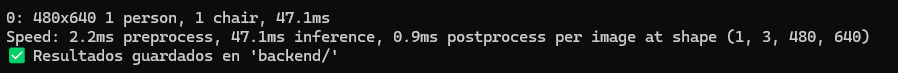
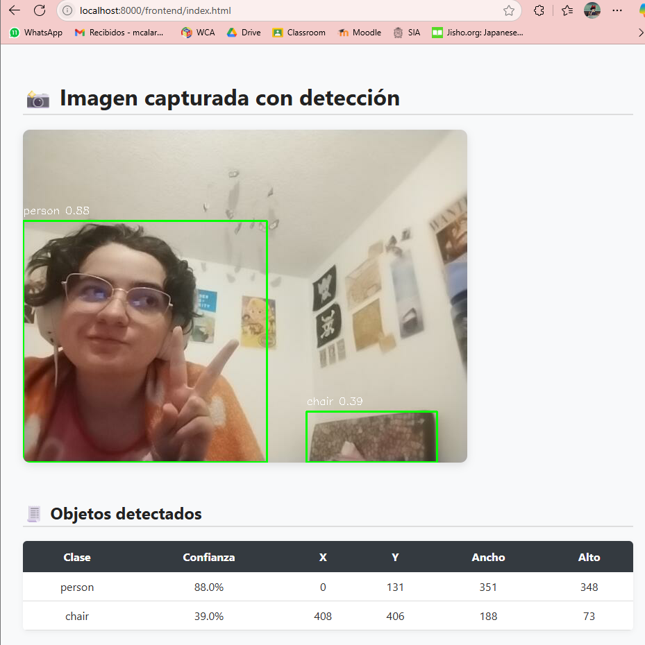

# 🎯 Taller - IA Visual Colaborativa: Comparte tus Resultados en Web

## 📅 Fecha  
**2025-06-21**

---

## 🌷 Equipo de trabajo

**Mi grupo está conformado por:**

- Julián Ramírez Díaz (julramirezdi@unal.edu.co)  
- Julián David Rincón Orjuela (jurinconor@unal.edu.co)  
- María Fernanda Cala Rodríguez (mcalar@unal.edu.co)  

**Este taller fue realizado por:**  
- María Fernanda Cala Rodríguez (mcalar@unal.edu.co)

---

## 🎯 Objetivo del Taller

Desarrollar un sistema que permita capturar un frame desde cámara, aplicar detección de objetos utilizando YOLOv8, guardar los resultados como una imagen anotada y como archivo estructurado en JSON, y finalmente visualizar esa información en una página web sencilla. La meta es facilitar el análisis y la comprensión visual de resultados de IA por parte de cualquier persona.

---

## 🧠 Conceptos Aplicados

- ✅ Captura de imagen desde webcam con OpenCV  
- ✅ Detección de objetos usando modelos YOLOv8  
- ✅ Exportación de resultados en formatos JSON, CSV e imagen  
- ✅ Visualización de detecciones desde HTML usando JavaScript  
- ✅ Lectura y despliegue de información visual y estructurada en el navegador  
- ✅ Separación clara entre Backend (Python) y Frontend (Web)

---

## 🛠️ Herramientas Necesarias

- Python 3.10+  
- openCV  
- ultralytics (YOLOv8)  
- json, csv, os  
- HTML, CSS, JavaScript

---

## 📁 Estructura del Proyecto

```
ia_visual_web/
├── backend/
│   ├── main.py                # Script de detección y exportación
│   ├── deteccion.png          # Imagen con los bounding boxes
│   ├── resultados.json        # Resultados estructurados por objeto
│   └── resumen.csv            # Datos resumidos para análisis posterior
└── frontend/
    └── index.html             # Visualizador web de resultados
```

---

## 🔧 Funcionalidad del Backend

- Captura un solo frame desde la webcam.
- Aplica YOLOv8 para detectar objetos.
- Dibuja las detecciones sobre la imagen.
- Guarda:
  - Imagen con anotaciones (`deteccion.png`)
  - Archivo `resultados.json` con timestamp, clase, bounding boxes y confianza.
  - Archivo `resumen.csv` (opcional) con las detecciones en formato tabular.

---

### 🧩 Fragmento de código clave

```python
model = YOLO("yolov8n.pt")
results = model(frame)[0]

for box in results.boxes:
    x1, y1, x2, y2 = map(int, box.xyxy[0])
    conf = float(box.conf[0])
    cls = int(box.cls[0])
    clase = model.names[cls]

    if conf > 0.5:
        detecciones_json["objects"].append({
            "class": clase,
            "confidence": round(conf, 2),
            "x": x1, "y": y1, "w": x2 - x1, "h": y2 - y1
        })
```

---

## 🌐 Visualización Web

- Carga la imagen generada por el backend.
- Lee el archivo `resultados.json`.
- Muestra los datos en una tabla dinámica usando HTML + JS.
- Estiliza la página con CSS para mayor claridad.

### 🖥️ Demostraciones





---

## 📊 Ejemplo de JSON generado

```json
{
  "timestamp": "2025-06-21T14:23:11",
  "objects": [
    {
      "class": "person",
      "confidence": 0.91,
      "x": 105, "y": 62,
      "w": 72, "h": 140
    }
  ]
}
```

---

## 🧠 Prompts


GPT-4o:
```
Crea un script en Python que:
- Capture un frame desde la webcam usando OpenCV
- Aplique un modelo de detección como YOLOv8 (Ultralytics)
- Dibuje los bounding boxes sobre la imagen y guarde el resultado como deteccion.png
- Genere un archivo resultados.json con los objetos detectados (clase, confianza, x, y, w, h)
- Opcional: guardar también un resumen en CSV para métricas
```


GPT-4o:
```
Crea una página HTML que:
- Muestre la imagen deteccion.png
- Lea resultados.json con fetch() y construya una tabla HTML con los datos
- Estiliza la página con CSS para que se vea limpia y moderna: tipografía clara, colores suaves, tabla con hover y bordes redondeados
- Muestra un mensaje de "no se detectaron objetos" si el JSON está vacío
- Agrega manejo de errores si fetch falla

```


GPT-4o:
```
GPT-4o:

Genera un README.md completo para un taller titulado "IA Visual Colaborativa: Comparte tus Resultados en Web".
Debe incluir:
- Título, fecha y equipo de trabajo
- Objetivo del taller
- Herramientas necesarias
- Estructura del proyecto
- Descripción de las actividades del backend (detección y exportación)
- Actividades del frontend (visualización de resultados)
- Fragmentos clave de código
- Reflexión final del ejercicio
- Sección de prompts utilizados, formateada como bloque de código

```


## 💡 Reflexión Final

Este taller permitió integrar los componentes clave de un sistema de IA visual: desde la captura y detección, hasta la exportación estructurada y visualización web. El trabajo con YOLOv8 y OpenCV resultó eficiente, y el hecho de compartir resultados en la web agrega una dimensión colaborativa muy valiosa.

El enfoque modular facilita su adaptación a otros casos de uso: desde educación hasta prototipos en industria o investigación.
