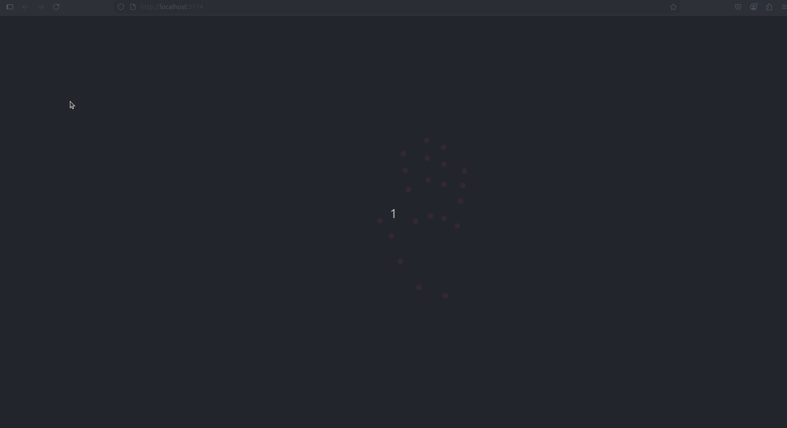

# 👋 Visualizador de Seguimiento de Manos en 3D

## 📅 Fecha
2025-06-23

---

## 🎯 Objetivo del Taller

Desarrollar un sistema de seguimiento de manos en tiempo real que capture los movimientos a través de una webcam y los visualice en un entorno 3D interactivo. El proyecto integra visión por computador con gráficos 3D mediante Python, MediaPipe y Three.js.

---

## 🧠 Conceptos Aprendidos

- **Seguimiento de manos** en tiempo real con MediaPipe
- Implementación de **comunicación WebSocket**
- Visualización **3D interactiva** con Three.js
- **Procesamiento de video** en tiempo real
- Integración de **backend Python** con **frontend JavaScript**

---

## 🔧 Herramientas y Entornos

### Backend
- Python 3.12
- OpenCV
- MediaPipe
- WebSockets

### Frontend
- React
- Three.js
- React Three Fiber

---

## 🧪 Implementación


### 🔹 Código Principal

```python
# Backend: Procesamiento de manos
class VisionProcessor:
    def __init__(self):
        self.mp_hands = mp.solutions.hands
        self.hands = self.mp_hands.Hands()
        self.cap = cv2.VideoCapture(0)
```

```javascript
// Frontend: Visualización 3D
export function HandVisualizer() {
    const [handData, setHandData] = useState([])
    const points = useRef([])

    useEffect(() => {
        const ws = new WebSocket('ws://localhost:8765')
        // ...configuración de WebSocket
    }, [])
}
```

---

## 📊 Resultados

- **Seguimiento en tiempo real** de 21 puntos por mano
- **Visualización 3D interactiva** con control de cámara
- **Comunicación bidireccional** mediante WebSocket
- **Rendimiento fluido** a 30 FPS

> 


---

## ⚠️ Requisitos

- Webcam
- Navegador con soporte WebGL
- Python 3.12+
- Node.js 16+
- Buena iluminación para el seguimiento

---

## 🧩 Prompts Usados

- Necesito crear un sistema de seguimiento de manos en 3D usando Python y Three.js, con comunicación WebSocket en tiempo real. ¿Podrías ayudarme con la implementación?

---

## 💬 Reflexión Final

Este proyecto demuestra la integración efectiva de tecnologías de visión por computador y gráficos 3D. La combinación de MediaPipe para el seguimiento preciso de manos y Three.js para la visualización interactiva crea una experiencia inmersiva y responsiva.

---