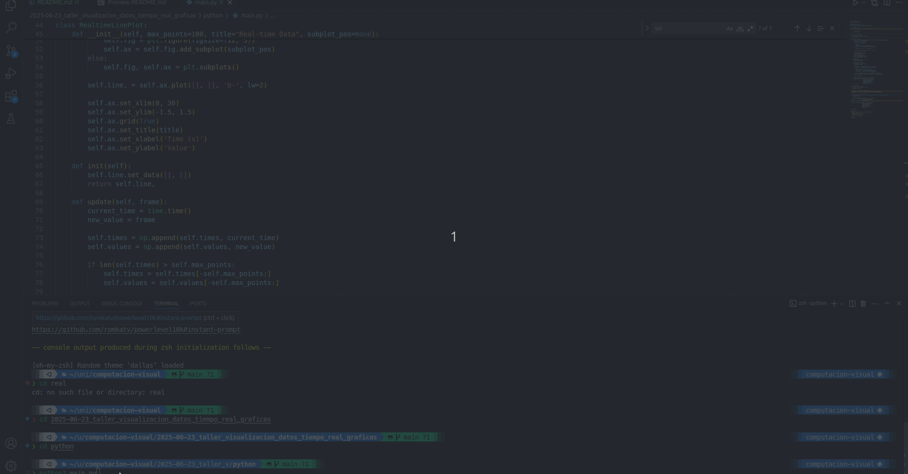

# 📊 Visualización de Datos en Tiempo Real

## 📅 Fecha
2025-06-23

---

## 🎯 Objetivo del Taller

Desarrollar un sistema de visualización de datos en tiempo real que permite mostrar gráficas dinámicas actualizadas continuamente. El proyecto implementa diferentes fuentes de datos (simulados y reales) y demuestra técnicas de visualización interactiva.

---

## 🧠 Conceptos Aprendidos

- Animación de gráficos en tiempo real con **Matplotlib**
- Manejo de **streams de datos** continuos
- Técnicas de **actualización dinámica** de visualizaciones
- **Multithreading** para manejo de datos y visualización simultánea

---

## 🔧 Herramientas y Entornos

- Python 3.12
- Matplotlib
- NumPy
- OpenCV
- Pandas

---

## 🧪 Implementación

### 🔹 Ejemplos de Código Principal

```python
# Generador de Datos
class DataGenerator:
    def __init__(self, data_type="sine", queue=None):
        self.data_type = data_type
        self.t = 0
        self.queue = queue
        
    def __next__(self):
        if self.data_type == "sine":
            value = np.sin(self.t)
        elif self.data_type == "random":
            value = np.random.normal(0, 1)
            
        self.t += 0.1
        if self.queue:
            self.queue.put((self.data_type, value))
        return value

# Visualizador en Tiempo Real
class RealtimeLinePlot:
    def __init__(self, max_points=100, title="Real-time Data", subplot_pos=None):
        self.max_points = max_points
        self.times = np.array([])
        self.values = np.array([])
        
        if subplot_pos:
            self.fig = plt.figure(figsize=(12, 5))
            self.ax = self.fig.add_subplot(subplot_pos)
        else:
            self.fig, self.ax = plt.subplots()
            
        self.line, = self.ax.plot([], [], 'b-', lw=2)
        self.ax.grid(True)
        self.ax.set_title(title)

```
---

## 📊 Resultados

Implementaciones realizadas:
- **Datos Sintéticos:** Visualización de ondas sinusoidales
- **Gráficos Dinámicos:** 
  - Gráfico de líneas para series temporales
  - Actualización en tiempo real

> 

---

## 🧩 Prompts Usados

- Necesito crear un sistema de visualización de datos en tiempo real usando Python y Matplotlib. Debe poder mostrar tanto datos simulados como datos reales de detección de objetos, actualizándose continuamente en una gráfica animada. ¿Podrías ayudarme con la implementación?

---

## 💬 Reflexión Final

Este proyecto demuestra la importancia de la visualización de datos en tiempo real para monitoreo y análisis. Las técnicas aprendidas son aplicables en diversos campos, desde monitoreo de sistemas hasta análisis de datos científicos en vivo.

---