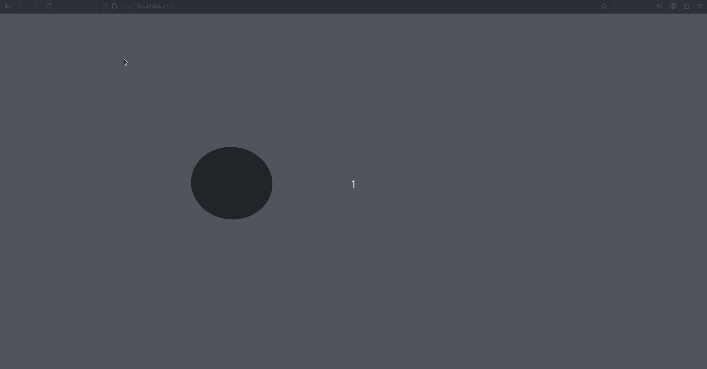

# 🔄 Visualización 3D con WebSockets en Tiempo Real

## 📅 Fecha
2025-06-23

---

## 🎯 Objetivo del Taller

Desarrollar una aplicación web que integre WebSockets para la comunicación en tiempo real entre un servidor Python y una visualización 3D en Three.js. El proyecto demuestra cómo crear interfaces interactivas que responden a datos en tiempo real, utilizando tecnologías modernas de comunicación web y gráficos 3D.

---

## 🧠 Conceptos Aprendidos

- Implementación de **WebSockets** para comunicación bidireccional
- Desarrollo de visualizaciones 3D con **Three.js** y **React Three Fiber**
- Manejo de **estado en tiempo real** en aplicaciones web
- Integración de **Python** como backend para generación de datos
- Uso de **hooks personalizados** en React
- Manipulación de objetos 3D mediante datos externos

---
## 📡 ¿Qué son los WebSockets?

Los WebSockets son un protocolo de comunicación que proporciona un canal de comunicación bidireccional y full-duplex sobre una única conexión TCP. A diferencia del modelo tradicional HTTP request/response:

### Características Principales:

- **Conexión Persistente:** Una vez establecida, la conexión permanece abierta hasta que alguna de las partes la cierre.
- **Comunicación Bidireccional:** Tanto el cliente como el servidor pueden enviar mensajes en cualquier momento.
- **Baja Latencia:** Al no necesitar establecer nuevas conexiones para cada intercambio, la comunicación es más rápida.
- **Tiempo Real:** Ideal para aplicaciones que requieren actualizaciones instantáneas.

### Diferencias con HTTP tradicional:

| HTTP Tradicional | WebSocket |
|-----------------|-----------|
| Conexión nueva por cada request | Una única conexión persistente |
| Solo el cliente inicia la comunicación | Ambas partes pueden iniciar |
| Headers en cada request | Headers solo en el handshake inicial |
| Latencia más alta | Latencia más baja |

Este protocolo es especialmente útil en aplicaciones como:
- Chat en tiempo real
- Juegos multijugador
- Visualización de datos en vivo
- Monitoreo en tiempo real

---

## 🔧 Herramientas y Entornos

- Python 3.12
  - websockets
  - asyncio
- Node.js y React
  - Three.js
  - React Three Fiber
  - @react-three/drei
- Vite como bundler
- WebSocket API

---

## 🧪 Implementación

### 🔹 Flujo General
1. Servidor Python genera datos aleatorios
2. WebSocket transmite datos al cliente web
3. React actualiza la visualización 3D
4. La esfera se mueve y cambia de color en tiempo real

### 🔹 Código relevante

```python
# Servidor WebSocket (Python)
async def handler(websocket):
    while True:
        data = {
            "x": random.uniform(-5, 5),
            "y": random.uniform(-5, 5),
            "color": random.choice(["red", "green", "blue"])
        }
        await websocket.send(json.dumps(data))
        await asyncio.sleep(0.5)
```

```jsx
// Cliente Three.js (React)
export default function WebSocketObject() {
  const meshRef = useRef()
  const { data } = useWebSocket('ws://localhost:8765')

  useFrame(() => {
    if (meshRef.current && data) {
      meshRef.current.position.x = data.x
      meshRef.current.position.y = data.y
      meshRef.current.material.color.set(data.color)
    }
  })
}
```

---

## 📊 Resultados Visuales

La aplicación demuestra una integración fluida entre backend y frontend:
- **Comunicación en Tiempo Real:** Actualización continua de posición y color
- **Visualización 3D Interactiva:** Objeto 3D responde a datos del servidor
- **Controles de Cámara:** Permite explorar la escena desde cualquier ángulo
- **Efectos Visuales:** Materiales físicos y animaciones suaves

> 

La visualización muestra cómo los WebSockets permiten crear experiencias interactivas fluidas sin necesidad de refrescar la página.

---

## 🧩 Prompts Usados

- Necesito crear una aplicación web que use WebSockets para actualizar una visualización 3D en tiempo real. El servidor debe enviar datos de posición y color cada 0.5 segundos, y un objeto 3D debe responder a estos cambios de forma fluida. ¿Podrías ayudarme con la implementación tanto del servidor como del cliente?

---

## 💬 Reflexión Final

Este proyecto demuestra el potencial de WebSockets para crear aplicaciones web interactivas en tiempo real. La combinación de Python para la generación de datos y Three.js para la visualización 3D ofrece un ejemplo práctico de cómo diferentes tecnologías pueden trabajar juntas para crear experiencias web dinámicas y atractivas.


---